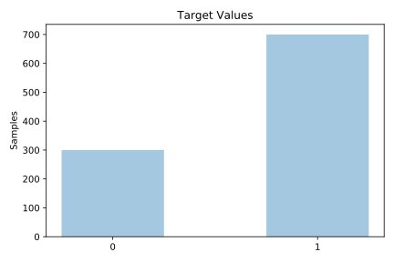
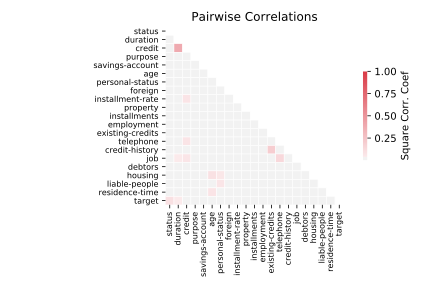

# german

[Metadata](metadata.yaml) | [Summary Statistics](summary_stats.csv)

## Summary

**task**: classification

**instances**: 1000

**features**: 20

**number of classes**: 20

## Summary Plots

## Data Summary

|	variable	|	count	|	mean	|	std	|	min	|	25%	|	50%	|	75%	|	max|
| --- | --- | --- | --- | --- | --- | --- | --- | --- |
|	Status	|	1000	|	1	|	0	|	0	|	0	|	1	|	2	|	3
|	Duration	|	1000	|	20	|	12	|	4	|	12	|	18	|	24	|	72
|	Credit-history	|	1000	|	3	|	1	|	0	|	2	|	4	|	4	|	4
|	Purpose	|	1000	|	4	|	2	|	0	|	3	|	4	|	6	|	9
|	Credit	|	1000	|	3271	|	2822	|	250	|	1365	|	2319	|	3972	|	18424
|	Savings-account	|	1000	|	1	|	1	|	0	|	1	|	1	|	2	|	4
|	Employment	|	1000	|	1	|	1	|	0	|	0	|	1	|	2	|	4
|	Installment-rate	|	1000	|	2	|	1	|	1	|	2	|	3	|	4	|	4
|	Personal-status	|	1000	|	1	|	1	|	0	|	0	|	3	|	3	|	3
|	Debtors	|	1000	|	1	|	0	|	0	|	2	|	2	|	2	|	2
|	Residence-time	|	1000	|	2	|	1	|	1	|	2	|	3	|	4	|	4
|	Property	|	1000	|	1	|	1	|	0	|	1	|	1	|	3	|	3
|	Age	|	1000	|	35	|	11	|	19	|	27	|	33	|	42	|	75
|	Installments	|	1000	|	0	|	0	|	0	|	1	|	1	|	1	|	2
|	Housing	|	1000	|	1	|	0	|	0	|	1	|	1	|	1	|	2
|	Existing-credits	|	1000	|	1	|	0	|	1	|	1	|	1	|	2	|	4
|	Job	|	1000	|	1	|	0	|	0	|	1	|	1	|	1	|	3
|	Liable-people	|	1000	|	1	|	0	|	1	|	1	|	1	|	1	|	2
|	Telephone	|	1000	|	0	|	0	|	0	|	0	|	1	|	1	|	1
|	Foreign	|	1000	|	0	|	0	|	0	|	1	|	1	|	1	|	1
|	target	|	1000	|	0	|	0	|	0	|	0	|	1	|	1	|	1
