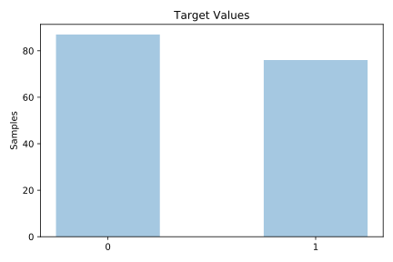
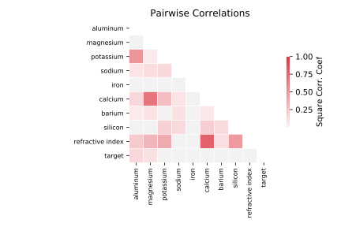

# glass2

[Metadata](metadata.yaml) | [Summary Statistics](summary_stats.csv)

## Summary

**task**: classification

**instances**: 163

**features**: 9

**number of classes**: 9

## Summary Plots

## Data Summary

|	variable	|	count	|	mean	|	std	|	min	|	25%	|	50%	|	75%	|	max|
| --- | --- | --- | --- | --- | --- | --- | --- | --- |
|	Refractive Index	|	163	|	1	|	0	|	1	|	1	|	1	|	1	|	1
|	Sodium	|	163	|	13	|	0	|	10	|	12	|	13	|	13	|	14
|	Magnesium	|	163	|	3	|	0	|	0	|	3	|	3	|	3	|	4
|	Aluminum	|	163	|	1	|	0	|	0	|	1	|	1	|	1	|	2
|	Silicon	|	163	|	72	|	0	|	69	|	72	|	72	|	73	|	74
|	Potassium	|	163	|	0	|	0	|	0	|	0	|	0	|	0	|	1
|	Calcium	|	163	|	8	|	1	|	7	|	8	|	8	|	9	|	16
|	Barium	|	163	|	0	|	0	|	0	|	0	|	0	|	0	|	3
|	Iron	|	163	|	0	|	0	|	0	|	0	|	0	|	0	|	0
|	target	|	163	|	0	|	0	|	0	|	0	|	0	|	1	|	1
