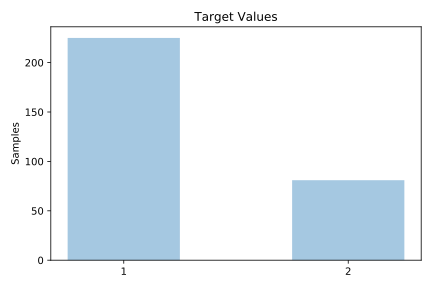
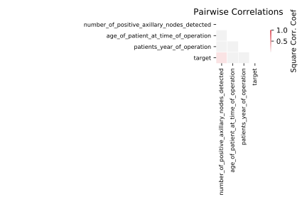

# haberman

[Metadata](metadata.yaml) | [Summary Statistics](summary_stats.csv)

## Summary

**task**: classification

**instances**: 306

**features**: 3

**number of classes**: 3

## Summary Plots

## Data Summary

|	variable	|	count	|	mean	|	std	|	min	|	25%	|	50%	|	75%	|	max|
| --- | --- | --- | --- | --- | --- | --- | --- | --- |
|	Age_of_patient_at_time_of_operation	|	306	|	52	|	10	|	30	|	44	|	52	|	60	|	83
|	Patients_year_of_operation	|	306	|	62	|	3	|	58	|	60	|	63	|	65	|	69
|	Number_of_positive_axillary_nodes_detected	|	306	|	4	|	7	|	0	|	0	|	1	|	4	|	52
|	target	|	306	|	1	|	0	|	1	|	1	|	1	|	2	|	2
