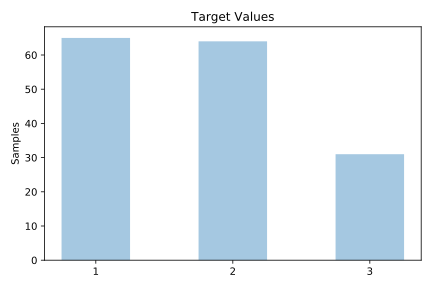
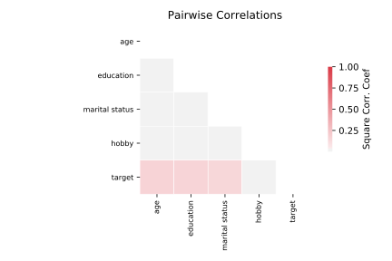

# hayes_roth

[Metadata](metadata.yaml) | [Summary Statistics](summary_stats.csv)

## Summary

**task**: classification

**instances**: 160

**features**: 4

**number of classes**: 4

## Summary Plots

## Data Summary

|	variable	|	count	|	mean	|	std	|	min	|	25%	|	50%	|	75%	|	max|
| --- | --- | --- | --- | --- | --- | --- | --- | --- |
|	Hobby	|	160	|	1	|	0	|	1	|	1	|	2	|	3	|	3
|	Age	|	160	|	1	|	0	|	1	|	1	|	2	|	3	|	4
|	Education	|	160	|	1	|	0	|	1	|	1	|	2	|	3	|	4
|	Marital status	|	160	|	1	|	0	|	1	|	1	|	2	|	3	|	4
|	target	|	160	|	1	|	0	|	1	|	1	|	2	|	2	|	3
