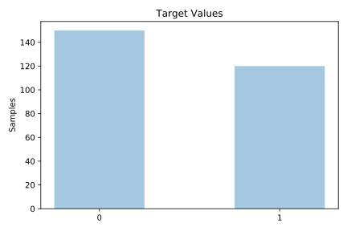
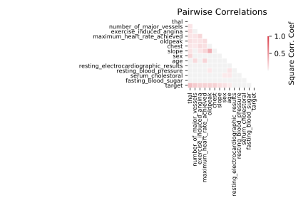

# heart_statlog

[Metadata](metadata.yaml) | [Summary Statistics](summary_stats.csv)

## Summary

**task**: classification

**instances**: 270

**features**: 13

**number of classes**: 13

## Summary Plots

## Data Summary

|	variable	|	count	|	mean	|	std	|	min	|	25%	|	50%	|	75%	|	max|
| --- | --- | --- | --- | --- | --- | --- | --- | --- |
|	age	|	270	|	54	|	9	|	29	|	48	|	55	|	61	|	77
|	sex	|	270	|	0	|	0	|	0	|	0	|	1	|	1	|	1
|	chest	|	270	|	3	|	0	|	1	|	3	|	3	|	4	|	4
|	resting_blood_pressure	|	270	|	131	|	17	|	94	|	120	|	130	|	140	|	200
|	serum_cholestoral	|	270	|	249	|	51	|	126	|	213	|	245	|	280	|	564
|	fasting_blood_sugar	|	270	|	0	|	0	|	0	|	0	|	0	|	0	|	1
|	resting_electrocardiographic_results	|	270	|	1	|	0	|	0	|	0	|	2	|	2	|	2
|	maximum_heart_rate_achieved	|	270	|	149	|	23	|	71	|	133	|	153	|	166	|	202
|	exercise_induced_angina	|	270	|	0	|	0	|	0	|	0	|	0	|	1	|	1
|	oldpeak	|	270	|	1	|	1	|	0	|	0	|	0	|	1	|	6
|	slope	|	270	|	1	|	0	|	1	|	1	|	2	|	2	|	3
|	number_of_major_vessels	|	270	|	0	|	0	|	0	|	0	|	0	|	1	|	3
|	thal	|	270	|	4	|	1	|	3	|	3	|	3	|	7	|	7
|	target	|	270	|	0	|	0	|	0	|	0	|	0	|	1	|	1
