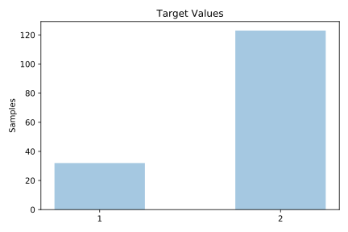
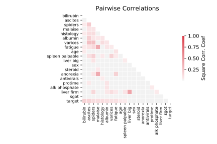

# hepatitis

[Metadata](metadata.yaml) | [Summary Statistics](summary_stats.csv)

## Summary

**task**: classification

**instances**: 155

**features**: 19

**number of classes**: 19

## Summary Plots

## Data Summary

|	variable	|	count	|	mean	|	std	|	min	|	25%	|	50%	|	75%	|	max|
| --- | --- | --- | --- | --- | --- | --- | --- | --- |
|	AGE	|	155	|	41	|	12	|	7	|	32	|	39	|	50	|	78
|	SEX	|	155	|	1	|	0	|	1	|	1	|	1	|	1	|	2
|	STEROID	|	155	|	0	|	0	|	0	|	0	|	1	|	1	|	2
|	ANTIVIRALS	|	155	|	1	|	0	|	1	|	2	|	2	|	2	|	2
|	FATIGUE	|	155	|	0	|	0	|	0	|	0	|	0	|	1	|	2
|	MALAISE	|	155	|	0	|	0	|	0	|	0	|	1	|	1	|	2
|	ANOREXIA	|	155	|	0	|	0	|	0	|	1	|	1	|	1	|	2
|	LIVER BIG	|	155	|	0	|	0	|	0	|	1	|	1	|	1	|	2
|	LIVER FIRM	|	155	|	0	|	0	|	0	|	0	|	1	|	1	|	2
|	SPLEEN PALPABLE	|	155	|	0	|	0	|	0	|	1	|	1	|	1	|	2
|	SPIDERS	|	155	|	0	|	0	|	0	|	0	|	1	|	1	|	2
|	ASCITES	|	155	|	0	|	0	|	0	|	1	|	1	|	1	|	2
|	VARICES	|	155	|	0	|	0	|	0	|	1	|	1	|	1	|	2
|	BILIRUBIN	|	155	|	10	|	8	|	0	|	5	|	7	|	13	|	34
|	ALK PHOSPHATE	|	155	|	54	|	27	|	0	|	30	|	64	|	76	|	83
|	SGOT	|	155	|	46	|	23	|	0	|	28	|	48	|	66	|	84
|	ALBUMIN	|	155	|	15	|	7	|	0	|	11	|	16	|	19	|	29
|	PROTIME	|	155	|	30	|	15	|	0	|	19	|	38	|	44	|	44
|	HISTOLOGY	|	155	|	1	|	0	|	1	|	1	|	1	|	2	|	2
|	target	|	155	|	1	|	0	|	1	|	2	|	2	|	2	|	2
