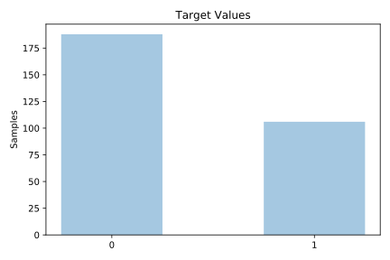

# hungarian

[Metadata](metadata.yaml) | [Summary Statistics](summary_stats.csv)

## Summary

**task**: classification

**instances**: 294

**features**: 13

**number of classes**: 13

## Summary Plots

## Data Summary

|	variable	|	count	|	mean	|	std	|	min	|	25%	|	50%	|	75%	|	max|
| --- | --- | --- | --- | --- | --- | --- | --- | --- |
|	age	|	294	|	47	|	7	|	28	|	42	|	49	|	54	|	66
|	sex	|	294	|	0	|	0	|	0	|	0	|	1	|	1	|	1
|	cp	|	294	|	2	|	0	|	1	|	2	|	3	|	4	|	4
|	trestbps	|	294	|	14	|	6	|	0	|	9	|	14	|	19	|	31
|	chol	|	294	|	77	|	44	|	0	|	41	|	73	|	111	|	153
|	fbs	|	294	|	0	|	0	|	0	|	0	|	0	|	0	|	2
|	restecg	|	294	|	0	|	0	|	0	|	0	|	0	|	0	|	3
|	thalach	|	294	|	32	|	17	|	0	|	20	|	31	|	44	|	71
|	exang	|	294	|	0	|	0	|	0	|	0	|	0	|	1	|	2
|	oldpeak	|	294	|	0	|	0	|	0	|	0	|	0	|	1	|	5
|	slope	|	294	|	2	|	1	|	0	|	1	|	3	|	3	|	3
|	ca	|	294	|	0	|	0	|	0	|	1	|	1	|	1	|	1
|	thal	|	294	|	2	|	0	|	0	|	3	|	3	|	3	|	3
|	target	|	294	|	0	|	0	|	0	|	0	|	0	|	1	|	1
