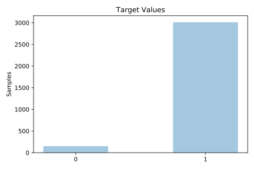
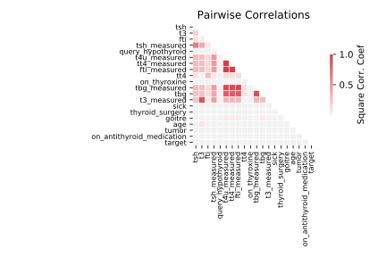

# hypothyroid

[Metadata](metadata.yaml) | [Summary Statistics](summary_stats.csv)

## Summary

**task**: classification

**instances**: 3163

**features**: 25

**number of classes**: 25

## Summary Plots

## Data Summary

|	variable	|	count	|	mean	|	std	|	min	|	25%	|	50%	|	75%	|	max|
| --- | --- | --- | --- | --- | --- | --- | --- | --- |
|	age	|	3163	|	50	|	25	|	0	|	29	|	51	|	69	|	92
|	sex	|	3163	|	1	|	0	|	0	|	1	|	1	|	2	|	2
|	on_thyroxine	|	3163	|	0	|	0	|	0	|	0	|	0	|	0	|	1
|	query_on_thyroxine	|	3163	|	0	|	0	|	0	|	0	|	0	|	0	|	1
|	on_antithyroid_medication	|	3163	|	0	|	0	|	0	|	0	|	0	|	0	|	1
|	thyroid_surgery	|	3163	|	0	|	0	|	0	|	0	|	0	|	0	|	1
|	query_hypothyroid	|	3163	|	0	|	0	|	0	|	0	|	0	|	0	|	1
|	query_hyperthyroid	|	3163	|	0	|	0	|	0	|	0	|	0	|	0	|	1
|	pregnant	|	3163	|	0	|	0	|	0	|	0	|	0	|	0	|	1
|	sick	|	3163	|	0	|	0	|	0	|	0	|	0	|	0	|	1
|	tumor	|	3163	|	0	|	0	|	0	|	0	|	0	|	0	|	1
|	lithium	|	3163	|	0	|	0	|	0	|	0	|	0	|	0	|	1
|	goitre	|	3163	|	0	|	0	|	0	|	0	|	0	|	0	|	1
|	TSH_measured	|	3163	|	0	|	0	|	0	|	1	|	1	|	1	|	1
|	TSH	|	3163	|	78	|	86	|	0	|	0	|	44	|	133	|	239
|	T3_measured	|	3163	|	0	|	0	|	0	|	1	|	1	|	1	|	1
|	T3	|	3163	|	31	|	21	|	0	|	16	|	23	|	41	|	69
|	TT4_measured	|	3163	|	0	|	0	|	0	|	1	|	1	|	1	|	1
|	TT4	|	3163	|	139	|	107	|	0	|	26	|	136	|	250	|	268
|	T4U_measured	|	3163	|	0	|	0	|	0	|	1	|	1	|	1	|	1
|	T4U	|	3163	|	73	|	32	|	0	|	54	|	66	|	79	|	158
|	FTI_measured	|	3163	|	0	|	0	|	0	|	1	|	1	|	1	|	1
|	FTI	|	3163	|	131	|	113	|	0	|	22	|	80	|	264	|	280
|	TBG_measured	|	3163	|	0	|	0	|	0	|	0	|	0	|	0	|	1
|	TBG	|	3163	|	49	|	8	|	0	|	52	|	52	|	52	|	52
|	target	|	3163	|	0	|	0	|	0	|	1	|	1	|	1	|	1
