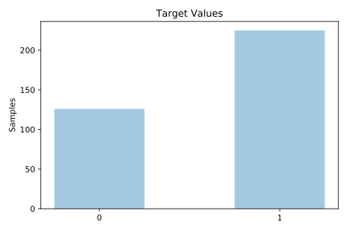
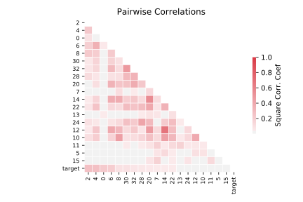

# ionosphere

[Metadata](metadata.yaml) | [Summary Statistics](summary_stats.csv)

## Summary

**task**: classification

**instances**: 351

**features**: 34

**number of classes**: 34

## Summary Plots

## Data Summary

|	variable	|	count	|	mean	|	std	|	min	|	25%	|	50%	|	75%	|	max|
| --- | --- | --- | --- | --- | --- | --- | --- | --- |
|	0	|	351	|	0	|	0	|	0	|	1	|	1	|	1	|	1
|	1	|	351	|	0	|	0	|	0	|	0	|	0	|	0	|	0
|	2	|	351	|	0	|	0	|	-1	|	0	|	0	|	1	|	1
|	3	|	351	|	0	|	0	|	-1	|	0	|	0	|	0	|	1
|	4	|	351	|	0	|	0	|	-1	|	0	|	0	|	1	|	1
|	5	|	351	|	0	|	0	|	-1	|	0	|	0	|	0	|	1
|	6	|	351	|	0	|	0	|	-1	|	0	|	0	|	0	|	1
|	7	|	351	|	0	|	0	|	-1	|	0	|	0	|	0	|	1
|	8	|	351	|	0	|	0	|	-1	|	0	|	0	|	0	|	1
|	9	|	351	|	0	|	0	|	-1	|	0	|	0	|	0	|	1
|	10	|	351	|	0	|	0	|	-1	|	0	|	0	|	0	|	1
|	11	|	351	|	0	|	0	|	-1	|	0	|	0	|	0	|	1
|	12	|	351	|	0	|	0	|	-1	|	0	|	0	|	0	|	1
|	13	|	351	|	0	|	0	|	-1	|	0	|	0	|	0	|	1
|	14	|	351	|	0	|	0	|	-1	|	0	|	0	|	0	|	1
|	15	|	351	|	0	|	0	|	-1	|	0	|	0	|	0	|	1
|	16	|	351	|	0	|	0	|	-1	|	0	|	0	|	0	|	1
|	17	|	351	|	0	|	0	|	-1	|	0	|	0	|	0	|	1
|	18	|	351	|	0	|	0	|	-1	|	0	|	0	|	0	|	1
|	19	|	351	|	0	|	0	|	-1	|	0	|	0	|	0	|	1
|	20	|	351	|	0	|	0	|	-1	|	0	|	0	|	0	|	1
|	21	|	351	|	0	|	0	|	-1	|	0	|	0	|	0	|	1
|	22	|	351	|	0	|	0	|	-1	|	0	|	0	|	0	|	1
|	23	|	351	|	0	|	0	|	-1	|	0	|	0	|	0	|	1
|	24	|	351	|	0	|	0	|	-1	|	0	|	0	|	0	|	1
|	25	|	351	|	0	|	0	|	-1	|	0	|	0	|	0	|	1
|	26	|	351	|	0	|	0	|	-1	|	0	|	0	|	0	|	1
|	27	|	351	|	0	|	0	|	-1	|	0	|	0	|	0	|	1
|	28	|	351	|	0	|	0	|	-1	|	0	|	0	|	0	|	1
|	29	|	351	|	0	|	0	|	-1	|	0	|	0	|	0	|	1
|	30	|	351	|	0	|	0	|	-1	|	0	|	0	|	0	|	1
|	31	|	351	|	0	|	0	|	-1	|	0	|	0	|	0	|	1
|	32	|	351	|	0	|	0	|	-1	|	0	|	0	|	0	|	1
|	33	|	351	|	0	|	0	|	-1	|	0	|	0	|	0	|	1
|	target	|	351	|	0	|	0	|	0	|	0	|	1	|	1	|	1
