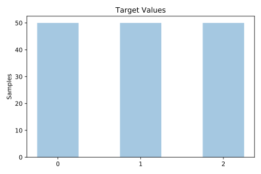
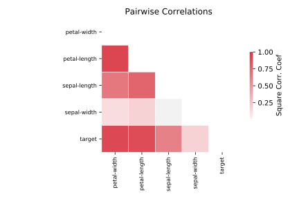

# iris

[Metadata](metadata.yaml) | [Summary Statistics](summary_stats.csv)

## Summary

**task**: classification

**instances**: 150

**features**: 4

**number of classes**: 4

## Summary Plots

## Data Summary

|	variable	|	count	|	mean	|	std	|	min	|	25%	|	50%	|	75%	|	max|
| --- | --- | --- | --- | --- | --- | --- | --- | --- |
|	sepal-length	|	150	|	5	|	0	|	4	|	5	|	5	|	6	|	7
|	sepal-width	|	150	|	3	|	0	|	2	|	2	|	3	|	3	|	4
|	petal-length	|	150	|	3	|	1	|	1	|	1	|	4	|	5	|	6
|	petal-width	|	150	|	1	|	0	|	0	|	0	|	1	|	1	|	2
|	target	|	150	|	1	|	0	|	0	|	0	|	1	|	2	|	2
