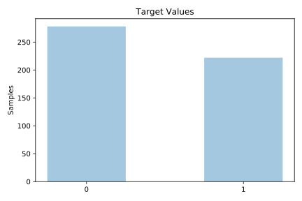
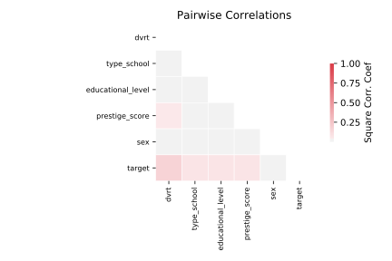

# irish

[Metadata](metadata.yaml) | [Summary Statistics](summary_stats.csv)

## Summary

**task**: classification

**instances**: 500

**features**: 5

**number of classes**: 5

## Summary Plots

## Data Summary

|	variable	|	count	|	mean	|	std	|	min	|	25%	|	50%	|	75%	|	max|
| --- | --- | --- | --- | --- | --- | --- | --- | --- |
|	Sex	|	500	|	0	|	0	|	0	|	0	|	0	|	1	|	1
|	DVRT	|	500	|	100	|	15	|	65	|	90	|	101	|	111	|	140
|	Educational_level	|	500	|	6	|	3	|	0	|	4	|	6	|	10	|	10
|	Prestige_score	|	500	|	10	|	8	|	0	|	2	|	8	|	18	|	28
|	Type_school	|	500	|	1	|	0	|	0	|	1	|	1	|	2	|	2
|	target	|	500	|	0	|	0	|	0	|	0	|	0	|	1	|	1
