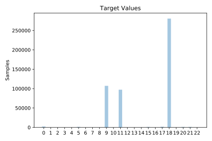

# kddcup

[Metadata](metadata.yaml) | [Summary Statistics](summary_stats.csv)

## Summary

**task**: classification

**instances**: 494020

**features**: 41

**number of classes**: 41

## Summary Plots

## Data Summary

|	variable	|	count	|	mean	|	std	|	min	|	25%	|	50%	|	75%	|	max|
| --- | --- | --- | --- | --- | --- | --- | --- | --- |
|	Atr-0	|	494020	|	47	|	707	|	0	|	0	|	0	|	0	|	58329
|	Atr-1	|	494020	|	0	|	0	|	0	|	0	|	0	|	1	|	2
|	Atr-2	|	494020	|	23	|	13	|	0	|	14	|	14	|	42	|	65
|	Atr-3	|	494020	|	7	|	2	|	0	|	9	|	9	|	9	|	10
|	Atr-4	|	494020	|	3025	|	988219	|	0	|	45	|	520	|	1032	|	693375640
|	Atr-5	|	494020	|	868	|	33040	|	0	|	0	|	0	|	0	|	5155468
|	Atr-6	|	494020	|	0	|	0	|	0	|	0	|	0	|	0	|	1
|	Atr-7	|	494020	|	0	|	0	|	0	|	0	|	0	|	0	|	3
|	Atr-8	|	494020	|	0	|	0	|	0	|	0	|	0	|	0	|	3
|	Atr-9	|	494020	|	0	|	0	|	0	|	0	|	0	|	0	|	30
|	Atr-10	|	494020	|	0	|	0	|	0	|	0	|	0	|	0	|	5
|	Atr-11	|	494020	|	0	|	0	|	0	|	0	|	0	|	0	|	1
|	Atr-12	|	494020	|	0	|	1	|	0	|	0	|	0	|	0	|	884
|	Atr-13	|	494020	|	0	|	0	|	0	|	0	|	0	|	0	|	1
|	Atr-14	|	494020	|	0	|	0	|	0	|	0	|	0	|	0	|	2
|	Atr-15	|	494020	|	0	|	2	|	0	|	0	|	0	|	0	|	993
|	Atr-16	|	494020	|	0	|	0	|	0	|	0	|	0	|	0	|	28
|	Atr-17	|	494020	|	0	|	0	|	0	|	0	|	0	|	0	|	2
|	Atr-18	|	494020	|	0	|	0	|	0	|	0	|	0	|	0	|	8
|	Atr-19	|	494020	|	0	|	0	|	0	|	0	|	0	|	0	|	0
|	Atr-20	|	494020	|	0	|	0	|	0	|	0	|	0	|	0	|	0
|	Atr-21	|	494020	|	0	|	0	|	0	|	0	|	0	|	0	|	1
|	Atr-22	|	494020	|	332	|	213	|	0	|	117	|	510	|	511	|	511
|	Atr-23	|	494020	|	292	|	246	|	0	|	10	|	510	|	511	|	511
|	Atr-24	|	494020	|	0	|	0	|	0	|	0	|	0	|	0	|	1
|	Atr-25	|	494020	|	0	|	0	|	0	|	0	|	0	|	0	|	1
|	Atr-26	|	494020	|	0	|	0	|	0	|	0	|	0	|	0	|	1
|	Atr-27	|	494020	|	0	|	0	|	0	|	0	|	0	|	0	|	1
|	Atr-28	|	494020	|	0	|	0	|	0	|	1	|	1	|	1	|	1
|	Atr-29	|	494020	|	0	|	0	|	0	|	0	|	0	|	0	|	1
|	Atr-30	|	494020	|	0	|	0	|	0	|	0	|	0	|	0	|	1
|	Atr-31	|	494020	|	232	|	64	|	0	|	255	|	255	|	255	|	255
|	Atr-32	|	494020	|	188	|	106	|	0	|	46	|	255	|	255	|	255
|	Atr-33	|	494020	|	0	|	0	|	0	|	0	|	1	|	1	|	1
|	Atr-34	|	494020	|	0	|	0	|	0	|	0	|	0	|	0	|	1
|	Atr-35	|	494020	|	0	|	0	|	0	|	0	|	1	|	1	|	1
|	Atr-36	|	494020	|	0	|	0	|	0	|	0	|	0	|	0	|	1
|	Atr-37	|	494020	|	0	|	0	|	0	|	0	|	0	|	0	|	1
|	Atr-38	|	494020	|	0	|	0	|	0	|	0	|	0	|	0	|	1
|	Atr-39	|	494020	|	0	|	0	|	0	|	0	|	0	|	0	|	1
|	Atr-40	|	494020	|	0	|	0	|	0	|	0	|	0	|	0	|	1
|	target	|	494020	|	14	|	4	|	0	|	11	|	18	|	18	|	22
