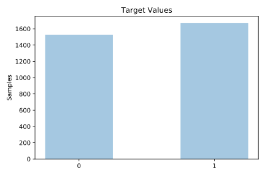
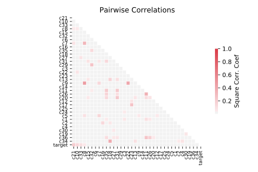

# kr_vs_kp

[Metadata](metadata.yaml) | [Summary Statistics](summary_stats.csv)

## Summary

**task**: classification

**instances**: 3196

**features**: 36

**number of classes**: 36

## Summary Plots

## Data Summary

|	variable	|	count	|	mean	|	std	|	min	|	25%	|	50%	|	75%	|	max|
| --- | --- | --- | --- | --- | --- | --- | --- | --- |
|	c1	|	3196	|	0	|	0	|	0	|	0	|	0	|	0	|	1
|	c2	|	3196	|	0	|	0	|	0	|	0	|	0	|	0	|	1
|	c3	|	3196	|	0	|	0	|	0	|	0	|	0	|	0	|	1
|	c4	|	3196	|	0	|	0	|	0	|	0	|	0	|	0	|	1
|	c5	|	3196	|	0	|	0	|	0	|	0	|	0	|	1	|	1
|	c6	|	3196	|	0	|	0	|	0	|	0	|	0	|	1	|	1
|	c7	|	3196	|	0	|	0	|	0	|	0	|	0	|	1	|	1
|	c8	|	3196	|	0	|	0	|	0	|	0	|	0	|	0	|	1
|	c9	|	3196	|	0	|	0	|	0	|	0	|	0	|	1	|	1
|	c10	|	3196	|	0	|	0	|	0	|	0	|	0	|	1	|	1
|	c11	|	3196	|	0	|	0	|	0	|	0	|	0	|	1	|	1
|	c12	|	3196	|	0	|	0	|	0	|	0	|	0	|	0	|	1
|	c13	|	3196	|	0	|	0	|	0	|	0	|	1	|	1	|	1
|	c14	|	3196	|	0	|	0	|	0	|	0	|	0	|	0	|	1
|	c15	|	3196	|	1	|	0	|	0	|	1	|	1	|	1	|	2
|	c16	|	3196	|	0	|	0	|	0	|	0	|	0	|	0	|	1
|	c17	|	3196	|	0	|	0	|	0	|	0	|	0	|	0	|	1
|	c18	|	3196	|	0	|	0	|	0	|	0	|	1	|	1	|	1
|	c19	|	3196	|	0	|	0	|	0	|	0	|	0	|	0	|	1
|	c20	|	3196	|	0	|	0	|	0	|	0	|	0	|	0	|	1
|	c21	|	3196	|	0	|	0	|	0	|	0	|	0	|	0	|	1
|	c22	|	3196	|	0	|	0	|	0	|	0	|	0	|	0	|	1
|	c23	|	3196	|	0	|	0	|	0	|	0	|	0	|	0	|	1
|	c24	|	3196	|	0	|	0	|	0	|	0	|	0	|	1	|	1
|	c25	|	3196	|	0	|	0	|	0	|	0	|	0	|	0	|	1
|	c26	|	3196	|	0	|	0	|	0	|	0	|	1	|	1	|	1
|	c27	|	3196	|	0	|	0	|	0	|	0	|	0	|	0	|	1
|	c28	|	3196	|	0	|	0	|	0	|	0	|	0	|	0	|	1
|	c29	|	3196	|	0	|	0	|	0	|	0	|	0	|	0	|	1
|	c30	|	3196	|	0	|	0	|	0	|	0	|	0	|	0	|	1
|	c31	|	3196	|	0	|	0	|	0	|	0	|	0	|	0	|	1
|	c32	|	3196	|	0	|	0	|	0	|	0	|	0	|	0	|	1
|	c33	|	3196	|	0	|	0	|	0	|	0	|	0	|	1	|	1
|	c34	|	3196	|	0	|	0	|	0	|	0	|	1	|	1	|	1
|	c35	|	3196	|	0	|	0	|	0	|	0	|	1	|	1	|	1
|	c36	|	3196	|	0	|	0	|	0	|	0	|	0	|	0	|	1
|	target	|	3196	|	0	|	0	|	0	|	0	|	1	|	1	|	1
