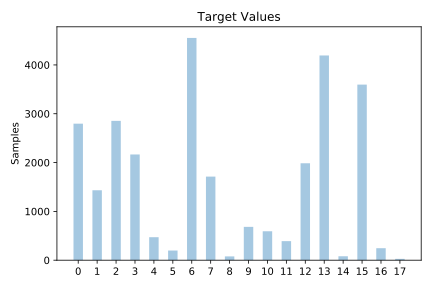
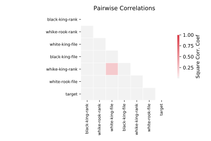

# krkopt

[Metadata](metadata.yaml) | [Summary Statistics](summary_stats.csv)

## Summary

**task**: classification

**instances**: 28056

**features**: 6

**number of classes**: 6

## Summary Plots

## Data Summary

|	variable	|	count	|	mean	|	std	|	min	|	25%	|	50%	|	75%	|	max|
| --- | --- | --- | --- | --- | --- | --- | --- | --- |
|	white-king-file	|	28056	|	2	|	0	|	0	|	1	|	2	|	3	|	3
|	whike-king-rank	|	28056	|	1	|	0	|	1	|	1	|	2	|	2	|	4
|	white-rook-file	|	28056	|	3	|	2	|	0	|	2	|	4	|	6	|	7
|	whike-rook-rank	|	28056	|	4	|	2	|	1	|	3	|	5	|	6	|	8
|	black-king-file	|	28056	|	4	|	2	|	0	|	2	|	4	|	6	|	7
|	black-king-rank	|	28056	|	4	|	2	|	1	|	3	|	4	|	6	|	8
|	target	|	28056	|	7	|	5	|	0	|	2	|	6	|	13	|	17
