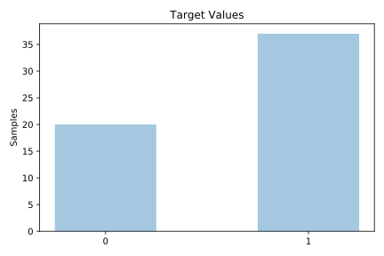
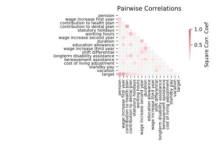

# labor

[Metadata](metadata.yaml) | [Summary Statistics](summary_stats.csv)

## Summary

**task**: classification

**instances**: 57

**features**: 16

**number of classes**: 16

## Summary Plots

## Data Summary

|	variable	|	count	|	mean	|	std	|	min	|	25%	|	50%	|	75%	|	max|
| --- | --- | --- | --- | --- | --- | --- | --- | --- |
|	duration	|	57	|	1	|	0	|	0	|	1	|	1	|	2	|	3
|	wage increase first year	|	57	|	6	|	4	|	0	|	2	|	7	|	9	|	17
|	wage increase second year	|	57	|	6	|	5	|	0	|	3	|	5	|	11	|	15
|	wage increase third year	|	57	|	7	|	2	|	0	|	8	|	9	|	9	|	9
|	cost of living adjustment	|	57	|	1	|	1	|	0	|	0	|	1	|	2	|	3
|	working hours	|	57	|	5	|	2	|	0	|	4	|	7	|	7	|	8
|	pension	|	57	|	0	|	0	|	0	|	0	|	0	|	2	|	3
|	standby pay	|	57	|	6	|	1	|	0	|	7	|	7	|	7	|	7
|	shift differential	|	57	|	7	|	2	|	0	|	6	|	9	|	10	|	10
|	education allowance	|	57	|	0	|	0	|	0	|	0	|	0	|	1	|	2
|	statutory holidays	|	57	|	1	|	1	|	0	|	1	|	1	|	2	|	6
|	vacation	|	57	|	1	|	0	|	0	|	1	|	2	|	3	|	3
|	longterm disability assistance	|	57	|	0	|	0	|	0	|	0	|	0	|	2	|	2
|	contribution to dental plan	|	57	|	1	|	1	|	0	|	0	|	1	|	2	|	3
|	bereavement assistance	|	57	|	1	|	0	|	0	|	0	|	1	|	2	|	2
|	contribution to health plan	|	57	|	1	|	1	|	0	|	0	|	1	|	2	|	3
|	target	|	57	|	0	|	0	|	0	|	0	|	1	|	1	|	1
