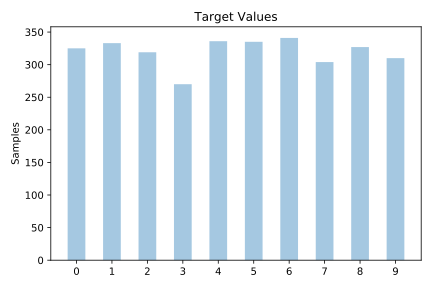
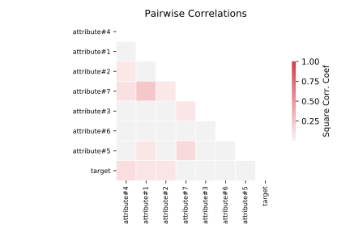

# led7

[Metadata](metadata.yaml) | [Summary Statistics](summary_stats.csv)

## Summary

**task**: classification

**instances**: 3200

**features**: 7

**number of classes**: 7

## Summary Plots

## Data Summary

|	variable	|	count	|	mean	|	std	|	min	|	25%	|	50%	|	75%	|	max|
| --- | --- | --- | --- | --- | --- | --- | --- | --- |
|	attribute#1	|	3200	|	0	|	0	|	0	|	0	|	1	|	1	|	1
|	attribute#2	|	3200	|	0	|	0	|	0	|	0	|	1	|	1	|	1
|	attribute#3	|	3200	|	0	|	0	|	0	|	0	|	1	|	1	|	1
|	attribute#4	|	3200	|	0	|	0	|	0	|	0	|	1	|	1	|	1
|	attribute#5	|	3200	|	0	|	0	|	0	|	0	|	0	|	1	|	1
|	attribute#6	|	3200	|	0	|	0	|	0	|	1	|	1	|	1	|	1
|	attribute#7	|	3200	|	0	|	0	|	0	|	0	|	1	|	1	|	1
|	target	|	3200	|	4	|	2	|	0	|	2	|	5	|	7	|	9
