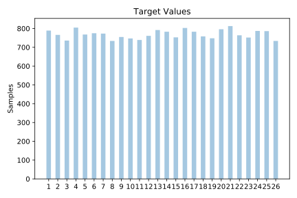
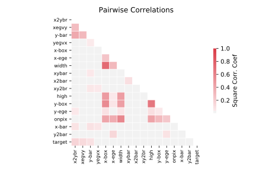

# letter

[Metadata](metadata.yaml) | [Summary Statistics](summary_stats.csv)

## Summary

**task**: classification

**instances**: 20000

**features**: 16

**number of classes**: 16

## Summary Plots

## Data Summary

|	variable	|	count	|	mean	|	std	|	min	|	25%	|	50%	|	75%	|	max|
| --- | --- | --- | --- | --- | --- | --- | --- | --- |
|	x-box	|	20000	|	4	|	1	|	0	|	3	|	4	|	5	|	15
|	y-box	|	20000	|	7	|	3	|	0	|	5	|	7	|	9	|	15
|	width	|	20000	|	5	|	2	|	0	|	4	|	5	|	6	|	15
|	high	|	20000	|	5	|	2	|	0	|	4	|	6	|	7	|	15
|	onpix	|	20000	|	3	|	2	|	0	|	2	|	3	|	5	|	15
|	x-bar	|	20000	|	6	|	2	|	0	|	6	|	7	|	8	|	15
|	y-bar	|	20000	|	7	|	2	|	0	|	6	|	7	|	9	|	15
|	x2bar	|	20000	|	4	|	2	|	0	|	3	|	4	|	6	|	15
|	y2bar	|	20000	|	5	|	2	|	0	|	4	|	5	|	7	|	15
|	xybar	|	20000	|	8	|	2	|	0	|	7	|	8	|	10	|	15
|	x2ybr	|	20000	|	6	|	2	|	0	|	5	|	6	|	8	|	15
|	xy2br	|	20000	|	7	|	2	|	0	|	7	|	8	|	9	|	15
|	x-ege	|	20000	|	3	|	2	|	0	|	1	|	3	|	4	|	15
|	xegvy	|	20000	|	8	|	1	|	0	|	8	|	8	|	9	|	15
|	y-ege	|	20000	|	3	|	2	|	0	|	2	|	3	|	5	|	15
|	yegvx	|	20000	|	7	|	1	|	0	|	7	|	8	|	9	|	15
|	target	|	20000	|	13	|	7	|	1	|	7	|	14	|	20	|	26
