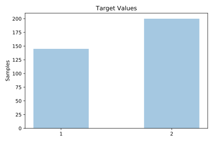
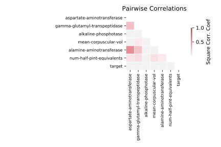

# liver_disorder

[Metadata](metadata.yaml) | [Summary Statistics](summary_stats.csv)

## Summary

**task**: classification

**instances**: 345

**features**: 6

**number of classes**: 6

## Summary Plots

## Data Summary

|	variable	|	count	|	mean	|	std	|	min	|	25%	|	50%	|	75%	|	max|
| --- | --- | --- | --- | --- | --- | --- | --- | --- |
|	mean-corpuscular-vol	|	345	|	90	|	4	|	65	|	87	|	90	|	93	|	103
|	alkaline-phosphotase	|	345	|	69	|	18	|	23	|	57	|	67	|	80	|	138
|	alamine-aminotransferase	|	345	|	30	|	19	|	4	|	19	|	26	|	34	|	155
|	aspartate-aminotransferase	|	345	|	24	|	10	|	5	|	19	|	23	|	27	|	82
|	gamma-glutamyl-transpeptidase	|	345	|	38	|	39	|	5	|	15	|	25	|	46	|	297
|	num-half-pint-equivalents	|	345	|	3	|	3	|	0	|	0	|	3	|	6	|	20
|	target	|	345	|	1	|	0	|	1	|	1	|	2	|	2	|	2
