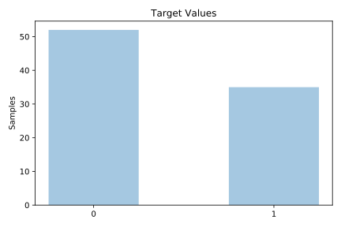
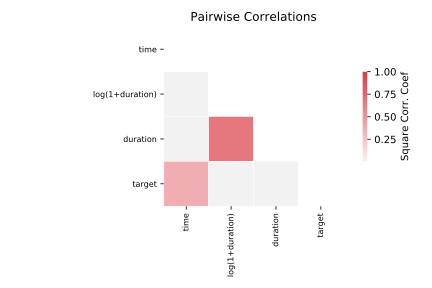

# lupus

[Metadata](metadata.yaml) | [Summary Statistics](summary_stats.csv)

## Summary

**task**: classification

**instances**: 87

**features**: 3

**number of classes**: 3

## Summary Plots

## Data Summary

|	variable	|	count	|	mean	|	std	|	min	|	25%	|	50%	|	75%	|	max|
| --- | --- | --- | --- | --- | --- | --- | --- | --- |
|	TIME	|	87	|	142	|	73	|	4	|	87	|	147	|	193	|	276
|	DURATION	|	87	|	10	|	21	|	0	|	0	|	2	|	9	|	106
|	LOG(1+DURATION)	|	87	|	1	|	1	|	0	|	0	|	1	|	2	|	4
|	target	|	87	|	0	|	0	|	0	|	0	|	0	|	1	|	1
