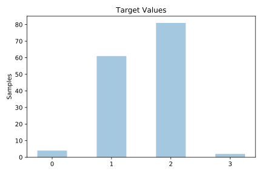
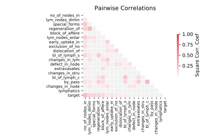

# lymphography

[Metadata](metadata.yaml) | [Summary Statistics](summary_stats.csv)

## Summary

**task**: classification

**instances**: 148

**features**: 18

**number of classes**: 18

## Summary Plots

## Data Summary

|	variable	|	count	|	mean	|	std	|	min	|	25%	|	50%	|	75%	|	max|
| --- | --- | --- | --- | --- | --- | --- | --- | --- |
|	Lymphatics	|	148	|	0	|	0	|	0	|	0	|	1	|	1	|	3
|	Block_of_affere	|	148	|	0	|	0	|	0	|	0	|	1	|	1	|	1
|	Bl_of_lymph_c	|	148	|	0	|	0	|	0	|	0	|	0	|	0	|	1
|	Bl_of_lymph_s	|	148	|	0	|	0	|	0	|	0	|	0	|	0	|	1
|	By_pass	|	148	|	0	|	0	|	0	|	0	|	0	|	0	|	1
|	Extravasates	|	148	|	0	|	0	|	0	|	0	|	1	|	1	|	1
|	Regeneration_of	|	148	|	0	|	0	|	0	|	0	|	0	|	0	|	1
|	Early_uptake_in	|	148	|	0	|	0	|	0	|	0	|	1	|	1	|	1
|	Lym_nodes_dimin	|	148	|	1	|	0	|	1	|	1	|	1	|	1	|	3
|	Lym_nodes_enlar	|	148	|	2	|	0	|	1	|	2	|	2	|	3	|	4
|	Changes_in_lym	|	148	|	1	|	0	|	0	|	1	|	1	|	2	|	2
|	Defect_in_node	|	148	|	1	|	0	|	0	|	0	|	1	|	2	|	3
|	Changes_in_node	|	148	|	1	|	0	|	0	|	1	|	1	|	2	|	3
|	Changes_in_stru	|	148	|	2	|	1	|	0	|	1	|	2	|	3	|	7
|	Special_forms	|	148	|	1	|	0	|	0	|	0	|	2	|	2	|	2
|	Dislocation_of	|	148	|	0	|	0	|	0	|	0	|	1	|	1	|	1
|	Exclusion_of_no	|	148	|	0	|	0	|	0	|	1	|	1	|	1	|	1
|	No_of_nodes_in	|	148	|	2	|	1	|	1	|	1	|	2	|	3	|	8
|	target	|	148	|	1	|	0	|	0	|	1	|	2	|	2	|	3
