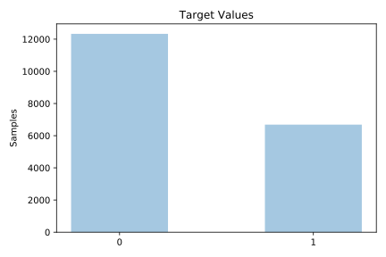
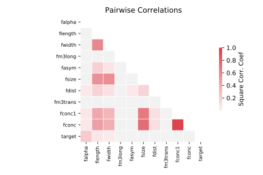

# magic

[Metadata](metadata.yaml) | [Summary Statistics](summary_stats.csv)

## Summary

**task**: classification

**instances**: 19020

**features**: 10

**number of classes**: 10

## Summary Plots

## Data Summary

|	variable	|	count	|	mean	|	std	|	min	|	25%	|	50%	|	75%	|	max|
| --- | --- | --- | --- | --- | --- | --- | --- | --- |
|	FLength	|	19020	|	53	|	42	|	4	|	24	|	37	|	70	|	334
|	FWidth	|	19020	|	22	|	18	|	0	|	11	|	17	|	24	|	256
|	FSize	|	19020	|	2	|	0	|	1	|	2	|	2	|	3	|	5
|	FConc	|	19020	|	0	|	0	|	0	|	0	|	0	|	0	|	0
|	FConc1	|	19020	|	0	|	0	|	0	|	0	|	0	|	0	|	0
|	FAsym	|	19020	|	-4	|	59	|	-457	|	-20	|	4	|	24	|	575
|	FM3Long	|	19020	|	10	|	51	|	-331	|	-12	|	15	|	35	|	238
|	FM3Trans	|	19020	|	0	|	20	|	-205	|	-10	|	0	|	10	|	179
|	FAlpha	|	19020	|	27	|	26	|	0	|	5	|	17	|	45	|	90
|	FDist	|	19020	|	193	|	74	|	1	|	142	|	191	|	240	|	495
|	target	|	19020	|	0	|	0	|	0	|	0	|	0	|	1	|	1
