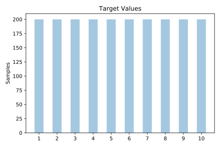
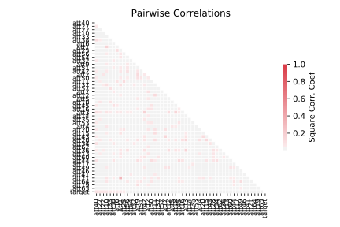

# mfeat_karhunen

[Metadata](metadata.yaml) | [Summary Statistics](summary_stats.csv)

## Summary

**task**: classification

**instances**: 2000

**features**: 64

**number of classes**: 64

## Summary Plots

## Data Summary

|	variable	|	count	|	mean	|	std	|	min	|	25%	|	50%	|	75%	|	max|
| --- | --- | --- | --- | --- | --- | --- | --- | --- |
|	att1	|	2000	|	-1	|	7	|	-16	|	-7	|	-1	|	4	|	15
|	att2	|	2000	|	0	|	5	|	-15	|	-4	|	0	|	3	|	15
|	att3	|	2000	|	1	|	5	|	-14	|	-2	|	2	|	5	|	14
|	att4	|	2000	|	1	|	5	|	-14	|	-2	|	0	|	5	|	16
|	att5	|	2000	|	2	|	3	|	-8	|	0	|	2	|	5	|	14
|	att6	|	2000	|	0	|	3	|	-9	|	-1	|	0	|	3	|	14
|	att7	|	2000	|	-1	|	4	|	-13	|	-4	|	-1	|	1	|	11
|	att8	|	2000	|	-1	|	3	|	-10	|	-3	|	-1	|	1	|	8
|	att9	|	2000	|	0	|	4	|	-10	|	-3	|	0	|	2	|	17
|	att10	|	2000	|	-1	|	3	|	-13	|	-4	|	-1	|	0	|	8
|	att11	|	2000	|	0	|	3	|	-8	|	-1	|	0	|	2	|	12
|	att12	|	2000	|	1	|	3	|	-9	|	0	|	1	|	4	|	11
|	att13	|	2000	|	0	|	2	|	-7	|	0	|	0	|	2	|	10
|	att14	|	2000	|	0	|	2	|	-9	|	-2	|	0	|	1	|	10
|	att15	|	2000	|	0	|	2	|	-7	|	-2	|	0	|	1	|	8
|	att16	|	2000	|	0	|	2	|	-7	|	-1	|	0	|	2	|	9
|	att17	|	2000	|	0	|	2	|	-8	|	-1	|	0	|	1	|	8
|	att18	|	2000	|	0	|	2	|	-6	|	0	|	0	|	2	|	8
|	att19	|	2000	|	0	|	2	|	-11	|	-2	|	0	|	0	|	7
|	att20	|	2000	|	0	|	2	|	-8	|	0	|	0	|	2	|	7
|	att21	|	2000	|	0	|	2	|	-9	|	-2	|	0	|	1	|	6
|	att22	|	2000	|	0	|	2	|	-8	|	-1	|	0	|	1	|	7
|	att23	|	2000	|	0	|	2	|	-8	|	0	|	0	|	2	|	9
|	att24	|	2000	|	0	|	1	|	-6	|	0	|	0	|	1	|	5
|	att25	|	2000	|	0	|	2	|	-7	|	-1	|	0	|	1	|	7
|	att26	|	2000	|	0	|	2	|	-7	|	-2	|	0	|	0	|	5
|	att27	|	2000	|	1	|	1	|	-4	|	0	|	0	|	2	|	7
|	att28	|	2000	|	0	|	2	|	-6	|	-1	|	0	|	1	|	7
|	att29	|	2000	|	0	|	1	|	-5	|	0	|	0	|	1	|	5
|	att30	|	2000	|	0	|	1	|	-6	|	0	|	0	|	1	|	5
|	att31	|	2000	|	0	|	1	|	-5	|	-2	|	0	|	0	|	5
|	att32	|	2000	|	0	|	1	|	-4	|	0	|	0	|	1	|	6
|	att33	|	2000	|	0	|	1	|	-5	|	-1	|	0	|	1	|	4
|	att34	|	2000	|	0	|	1	|	-6	|	-1	|	0	|	0	|	5
|	att35	|	2000	|	0	|	1	|	-5	|	0	|	0	|	1	|	4
|	att36	|	2000	|	0	|	1	|	-5	|	-1	|	0	|	0	|	5
|	att37	|	2000	|	0	|	1	|	-4	|	0	|	0	|	1	|	4
|	att38	|	2000	|	0	|	1	|	-3	|	0	|	0	|	1	|	5
|	att39	|	2000	|	0	|	1	|	-5	|	0	|	0	|	0	|	3
|	att40	|	2000	|	0	|	1	|	-4	|	0	|	0	|	0	|	4
|	att41	|	2000	|	0	|	1	|	-4	|	0	|	0	|	0	|	3
|	att42	|	2000	|	0	|	1	|	-5	|	0	|	0	|	1	|	4
|	att43	|	2000	|	0	|	1	|	-4	|	0	|	0	|	1	|	5
|	att44	|	2000	|	0	|	1	|	-4	|	-1	|	0	|	0	|	4
|	att45	|	2000	|	0	|	1	|	-4	|	0	|	0	|	0	|	5
|	att46	|	2000	|	0	|	1	|	-3	|	0	|	0	|	0	|	3
|	att47	|	2000	|	0	|	1	|	-4	|	0	|	0	|	0	|	4
|	att48	|	2000	|	0	|	1	|	-4	|	-1	|	0	|	0	|	2
|	att49	|	2000	|	0	|	1	|	-3	|	0	|	0	|	1	|	5
|	att50	|	2000	|	0	|	1	|	-4	|	0	|	0	|	0	|	3
|	att51	|	2000	|	0	|	1	|	-4	|	0	|	0	|	0	|	3
|	att52	|	2000	|	0	|	1	|	-3	|	0	|	0	|	0	|	3
|	att53	|	2000	|	0	|	1	|	-4	|	0	|	0	|	1	|	3
|	att54	|	2000	|	0	|	1	|	-3	|	0	|	0	|	0	|	3
|	att55	|	2000	|	0	|	1	|	-3	|	0	|	0	|	0	|	4
|	att56	|	2000	|	0	|	1	|	-3	|	0	|	0	|	0	|	3
|	att57	|	2000	|	0	|	0	|	-3	|	0	|	0	|	0	|	3
|	att58	|	2000	|	0	|	1	|	-4	|	0	|	0	|	0	|	3
|	att59	|	2000	|	0	|	0	|	-2	|	0	|	0	|	0	|	2
|	att60	|	2000	|	0	|	1	|	-3	|	0	|	0	|	0	|	3
|	att61	|	2000	|	0	|	0	|	-3	|	0	|	0	|	0	|	2
|	att62	|	2000	|	0	|	0	|	-3	|	0	|	0	|	0	|	2
|	att63	|	2000	|	0	|	0	|	-2	|	0	|	0	|	0	|	3
|	att64	|	2000	|	0	|	1	|	-3	|	0	|	0	|	0	|	3
|	target	|	2000	|	5	|	2	|	1	|	3	|	5	|	8	|	10
