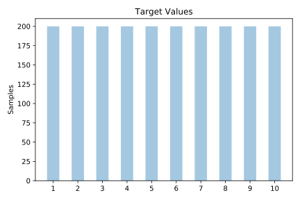
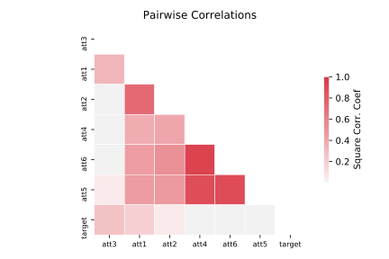

# mfeat_morphological

[Metadata](metadata.yaml) | [Summary Statistics](summary_stats.csv)

## Summary

**task**: classification

**instances**: 2000

**features**: 6

**number of classes**: 6

## Summary Plots

## Data Summary

|	variable	|	count	|	mean	|	std	|	min	|	25%	|	50%	|	75%	|	max|
| --- | --- | --- | --- | --- | --- | --- | --- | --- |
|	att1	|	2000	|	0	|	0	|	0	|	0	|	0	|	1	|	2
|	att2	|	2000	|	1	|	1	|	0	|	1	|	2	|	3	|	6
|	att3	|	2000	|	0	|	0	|	0	|	0	|	1	|	1	|	5
|	att4	|	2000	|	156	|	25	|	99	|	135	|	150	|	175	|	231
|	att5	|	2000	|	1	|	0	|	1	|	1	|	1	|	1	|	2
|	att6	|	2000	|	6155	|	3757	|	1439	|	3099	|	5255	|	9093	|	17572
|	target	|	2000	|	5	|	2	|	1	|	3	|	5	|	8	|	10
