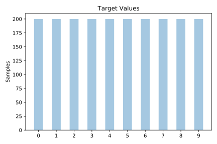
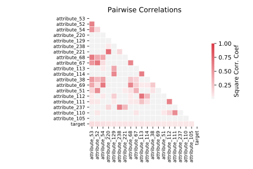

# mfeat_pixel

[Metadata](metadata.yaml) | [Summary Statistics](summary_stats.csv)

## Summary

**task**: classification

**instances**: 2000

**features**: 240

**number of classes**: 240

## Summary Plots

## Data Summary

|	variable	|	count	|	mean	|	std	|	min	|	25%	|	50%	|	75%	|	max|
| --- | --- | --- | --- | --- | --- | --- | --- | --- |
|	attribute_0	|	2000	|	0	|	1	|	0	|	0	|	0	|	0	|	6
|	attribute_1	|	2000	|	1	|	2	|	0	|	0	|	0	|	3	|	6
|	attribute_2	|	2000	|	2	|	2	|	0	|	0	|	1	|	4	|	6
|	attribute_3	|	2000	|	2	|	2	|	0	|	0	|	3	|	5	|	6
|	attribute_4	|	2000	|	3	|	2	|	0	|	0	|	4	|	6	|	6
|	attribute_5	|	2000	|	3	|	2	|	0	|	2	|	4	|	6	|	6
|	attribute_6	|	2000	|	4	|	2	|	0	|	3	|	5	|	6	|	6
|	attribute_7	|	2000	|	4	|	2	|	0	|	4	|	5	|	6	|	6
|	attribute_8	|	2000	|	4	|	2	|	0	|	3	|	5	|	6	|	6
|	attribute_9	|	2000	|	3	|	2	|	0	|	3	|	4	|	6	|	6
|	attribute_10	|	2000	|	3	|	2	|	0	|	1	|	4	|	6	|	6
|	attribute_11	|	2000	|	2	|	2	|	0	|	0	|	3	|	5	|	6
|	attribute_12	|	2000	|	2	|	2	|	0	|	0	|	1	|	4	|	6
|	attribute_13	|	2000	|	1	|	2	|	0	|	0	|	0	|	3	|	6
|	attribute_14	|	2000	|	0	|	1	|	0	|	0	|	0	|	0	|	6
|	attribute_15	|	2000	|	1	|	2	|	0	|	0	|	0	|	2	|	6
|	attribute_16	|	2000	|	2	|	2	|	0	|	0	|	1	|	6	|	6
|	attribute_17	|	2000	|	3	|	2	|	0	|	0	|	5	|	6	|	6
|	attribute_18	|	2000	|	4	|	2	|	0	|	2	|	6	|	6	|	6
|	attribute_19	|	2000	|	4	|	2	|	0	|	5	|	6	|	6	|	6
|	attribute_20	|	2000	|	5	|	2	|	0	|	6	|	6	|	6	|	6
|	attribute_21	|	2000	|	5	|	1	|	0	|	6	|	6	|	6	|	6
|	attribute_22	|	2000	|	5	|	1	|	0	|	6	|	6	|	6	|	6
|	attribute_23	|	2000	|	5	|	1	|	0	|	6	|	6	|	6	|	6
|	attribute_24	|	2000	|	5	|	1	|	0	|	6	|	6	|	6	|	6
|	attribute_25	|	2000	|	4	|	2	|	0	|	5	|	6	|	6	|	6
|	attribute_26	|	2000	|	4	|	2	|	0	|	1	|	6	|	6	|	6
|	attribute_27	|	2000	|	3	|	2	|	0	|	0	|	5	|	6	|	6
|	attribute_28	|	2000	|	2	|	2	|	0	|	0	|	1	|	6	|	6
|	attribute_29	|	2000	|	1	|	2	|	0	|	0	|	0	|	2	|	6
|	attribute_30	|	2000	|	1	|	2	|	0	|	0	|	0	|	2	|	6
|	attribute_31	|	2000	|	2	|	2	|	0	|	0	|	2	|	6	|	6
|	attribute_32	|	2000	|	3	|	2	|	0	|	0	|	6	|	6	|	6
|	attribute_33	|	2000	|	4	|	2	|	0	|	1	|	6	|	6	|	6
|	attribute_34	|	2000	|	4	|	2	|	0	|	2	|	6	|	6	|	6
|	attribute_35	|	2000	|	3	|	2	|	0	|	2	|	5	|	6	|	6
|	attribute_36	|	2000	|	3	|	2	|	0	|	2	|	4	|	6	|	6
|	attribute_37	|	2000	|	3	|	2	|	0	|	1	|	4	|	6	|	6
|	attribute_38	|	2000	|	3	|	2	|	0	|	2	|	5	|	6	|	6
|	attribute_39	|	2000	|	4	|	2	|	0	|	2	|	6	|	6	|	6
|	attribute_40	|	2000	|	4	|	2	|	0	|	2	|	6	|	6	|	6
|	attribute_41	|	2000	|	4	|	2	|	0	|	0	|	6	|	6	|	6
|	attribute_42	|	2000	|	3	|	2	|	0	|	0	|	6	|	6	|	6
|	attribute_43	|	2000	|	2	|	2	|	0	|	0	|	1	|	6	|	6
|	attribute_44	|	2000	|	1	|	1	|	0	|	0	|	0	|	1	|	6
|	attribute_45	|	2000	|	1	|	2	|	0	|	0	|	0	|	3	|	6
|	attribute_46	|	2000	|	2	|	2	|	0	|	0	|	2	|	6	|	6
|	attribute_47	|	2000	|	3	|	2	|	0	|	0	|	6	|	6	|	6
|	attribute_48	|	2000	|	3	|	2	|	0	|	0	|	6	|	6	|	6
|	attribute_49	|	2000	|	3	|	2	|	0	|	0	|	5	|	6	|	6
|	attribute_50	|	2000	|	2	|	2	|	0	|	0	|	2	|	6	|	6
|	attribute_51	|	2000	|	2	|	2	|	0	|	0	|	0	|	6	|	6
|	attribute_52	|	2000	|	2	|	2	|	0	|	0	|	0	|	6	|	6
|	attribute_53	|	2000	|	2	|	2	|	0	|	0	|	1	|	6	|	6
|	attribute_54	|	2000	|	3	|	2	|	0	|	0	|	3	|	6	|	6
|	attribute_55	|	2000	|	3	|	2	|	0	|	0	|	6	|	6	|	6
|	attribute_56	|	2000	|	3	|	2	|	0	|	0	|	6	|	6	|	6
|	attribute_57	|	2000	|	3	|	2	|	0	|	0	|	5	|	6	|	6
|	attribute_58	|	2000	|	2	|	2	|	0	|	0	|	0	|	6	|	6
|	attribute_59	|	2000	|	1	|	1	|	0	|	0	|	0	|	1	|	6
|	attribute_60	|	2000	|	1	|	2	|	0	|	0	|	0	|	3	|	6
|	attribute_61	|	2000	|	2	|	2	|	0	|	0	|	3	|	6	|	6
|	attribute_62	|	2000	|	3	|	2	|	0	|	0	|	6	|	6	|	6
|	attribute_63	|	2000	|	4	|	2	|	0	|	0	|	6	|	6	|	6
|	attribute_64	|	2000	|	3	|	2	|	0	|	0	|	6	|	6	|	6
|	attribute_65	|	2000	|	2	|	2	|	0	|	0	|	3	|	6	|	6
|	attribute_66	|	2000	|	2	|	2	|	0	|	0	|	1	|	6	|	6
|	attribute_67	|	2000	|	2	|	2	|	0	|	0	|	1	|	6	|	6
|	attribute_68	|	2000	|	2	|	2	|	0	|	0	|	2	|	6	|	6
|	attribute_69	|	2000	|	3	|	2	|	0	|	0	|	3	|	6	|	6
|	attribute_70	|	2000	|	3	|	2	|	0	|	0	|	6	|	6	|	6
|	attribute_71	|	2000	|	3	|	2	|	0	|	0	|	6	|	6	|	6
|	attribute_72	|	2000	|	3	|	2	|	0	|	0	|	5	|	6	|	6
|	attribute_73	|	2000	|	2	|	2	|	0	|	0	|	0	|	6	|	6
|	attribute_74	|	2000	|	1	|	1	|	0	|	0	|	0	|	1	|	6
|	attribute_75	|	2000	|	1	|	1	|	0	|	0	|	0	|	2	|	6
|	attribute_76	|	2000	|	2	|	2	|	0	|	0	|	3	|	6	|	6
|	attribute_77	|	2000	|	3	|	2	|	0	|	0	|	6	|	6	|	6
|	attribute_78	|	2000	|	4	|	2	|	0	|	1	|	6	|	6	|	6
|	attribute_79	|	2000	|	4	|	2	|	0	|	1	|	6	|	6	|	6
|	attribute_80	|	2000	|	3	|	2	|	0	|	0	|	5	|	6	|	6
|	attribute_81	|	2000	|	3	|	2	|	0	|	0	|	3	|	6	|	6
|	attribute_82	|	2000	|	2	|	2	|	0	|	0	|	3	|	6	|	6
|	attribute_83	|	2000	|	3	|	2	|	0	|	0	|	3	|	6	|	6
|	attribute_84	|	2000	|	3	|	2	|	0	|	0	|	5	|	6	|	6
|	attribute_85	|	2000	|	4	|	2	|	0	|	0	|	6	|	6	|	6
|	attribute_86	|	2000	|	4	|	2	|	0	|	1	|	6	|	6	|	6
|	attribute_87	|	2000	|	3	|	2	|	0	|	0	|	6	|	6	|	6
|	attribute_88	|	2000	|	2	|	2	|	0	|	0	|	1	|	6	|	6
|	attribute_89	|	2000	|	0	|	1	|	0	|	0	|	0	|	1	|	6
|	attribute_90	|	2000	|	0	|	1	|	0	|	0	|	0	|	1	|	6
|	attribute_91	|	2000	|	2	|	2	|	0	|	0	|	1	|	6	|	6
|	attribute_92	|	2000	|	3	|	2	|	0	|	0	|	6	|	6	|	6
|	attribute_93	|	2000	|	4	|	2	|	0	|	1	|	6	|	6	|	6
|	attribute_94	|	2000	|	4	|	2	|	0	|	1	|	6	|	6	|	6
|	attribute_95	|	2000	|	3	|	2	|	0	|	0	|	6	|	6	|	6
|	attribute_96	|	2000	|	3	|	2	|	0	|	0	|	4	|	6	|	6
|	attribute_97	|	2000	|	3	|	2	|	0	|	0	|	4	|	6	|	6
|	attribute_98	|	2000	|	3	|	2	|	0	|	0	|	5	|	6	|	6
|	attribute_99	|	2000	|	3	|	2	|	0	|	1	|	6	|	6	|	6
|	attribute_100	|	2000	|	4	|	2	|	0	|	3	|	6	|	6	|	6
|	attribute_101	|	2000	|	4	|	2	|	0	|	3	|	6	|	6	|	6
|	attribute_102	|	2000	|	3	|	2	|	0	|	0	|	6	|	6	|	6
|	attribute_103	|	2000	|	2	|	2	|	0	|	0	|	2	|	6	|	6
|	attribute_104	|	2000	|	0	|	1	|	0	|	0	|	0	|	0	|	6
|	attribute_105	|	2000	|	0	|	1	|	0	|	0	|	0	|	0	|	6
|	attribute_106	|	2000	|	2	|	2	|	0	|	0	|	1	|	6	|	6
|	attribute_107	|	2000	|	3	|	2	|	0	|	0	|	5	|	6	|	6
|	attribute_108	|	2000	|	3	|	2	|	0	|	0	|	6	|	6	|	6
|	attribute_109	|	2000	|	3	|	2	|	0	|	0	|	6	|	6	|	6
|	attribute_110	|	2000	|	3	|	2	|	0	|	0	|	5	|	6	|	6
|	attribute_111	|	2000	|	3	|	2	|	0	|	0	|	4	|	6	|	6
|	attribute_112	|	2000	|	3	|	2	|	0	|	0	|	4	|	6	|	6
|	attribute_113	|	2000	|	3	|	2	|	0	|	0	|	6	|	6	|	6
|	attribute_114	|	2000	|	4	|	2	|	0	|	2	|	6	|	6	|	6
|	attribute_115	|	2000	|	4	|	2	|	0	|	4	|	6	|	6	|	6
|	attribute_116	|	2000	|	4	|	2	|	0	|	4	|	6	|	6	|	6
|	attribute_117	|	2000	|	3	|	2	|	0	|	0	|	6	|	6	|	6
|	attribute_118	|	2000	|	2	|	2	|	0	|	0	|	2	|	6	|	6
|	attribute_119	|	2000	|	1	|	1	|	0	|	0	|	0	|	1	|	6
|	attribute_120	|	2000	|	0	|	1	|	0	|	0	|	0	|	0	|	6
|	attribute_121	|	2000	|	2	|	2	|	0	|	0	|	0	|	6	|	6
|	attribute_122	|	2000	|	3	|	2	|	0	|	0	|	4	|	6	|	6
|	attribute_123	|	2000	|	3	|	2	|	0	|	0	|	5	|	6	|	6
|	attribute_124	|	2000	|	3	|	2	|	0	|	0	|	5	|	6	|	6
|	attribute_125	|	2000	|	3	|	2	|	0	|	0	|	3	|	6	|	6
|	attribute_126	|	2000	|	2	|	2	|	0	|	0	|	3	|	6	|	6
|	attribute_127	|	2000	|	3	|	2	|	0	|	0	|	3	|	6	|	6
|	attribute_128	|	2000	|	3	|	2	|	0	|	0	|	5	|	6	|	6
|	attribute_129	|	2000	|	4	|	2	|	0	|	1	|	6	|	6	|	6
|	attribute_130	|	2000	|	4	|	2	|	0	|	4	|	6	|	6	|	6
|	attribute_131	|	2000	|	4	|	2	|	0	|	4	|	6	|	6	|	6
|	attribute_132	|	2000	|	4	|	2	|	0	|	1	|	6	|	6	|	6
|	attribute_133	|	2000	|	3	|	2	|	0	|	0	|	3	|	6	|	6
|	attribute_134	|	2000	|	1	|	1	|	0	|	0	|	0	|	2	|	6
|	attribute_135	|	2000	|	0	|	1	|	0	|	0	|	0	|	1	|	6
|	attribute_136	|	2000	|	2	|	2	|	0	|	0	|	0	|	6	|	6
|	attribute_137	|	2000	|	2	|	2	|	0	|	0	|	2	|	6	|	6
|	attribute_138	|	2000	|	3	|	2	|	0	|	0	|	3	|	6	|	6
|	attribute_139	|	2000	|	2	|	2	|	0	|	0	|	3	|	6	|	6
|	attribute_140	|	2000	|	2	|	2	|	0	|	0	|	1	|	6	|	6
|	attribute_141	|	2000	|	2	|	2	|	0	|	0	|	1	|	6	|	6
|	attribute_142	|	2000	|	2	|	2	|	0	|	0	|	2	|	6	|	6
|	attribute_143	|	2000	|	3	|	2	|	0	|	0	|	3	|	6	|	6
|	attribute_144	|	2000	|	3	|	2	|	0	|	1	|	5	|	6	|	6
|	attribute_145	|	2000	|	4	|	2	|	0	|	3	|	6	|	6	|	6
|	attribute_146	|	2000	|	4	|	2	|	0	|	4	|	6	|	6	|	6
|	attribute_147	|	2000	|	4	|	2	|	0	|	1	|	6	|	6	|	6
|	attribute_148	|	2000	|	3	|	2	|	0	|	0	|	4	|	6	|	6
|	attribute_149	|	2000	|	1	|	2	|	0	|	0	|	0	|	3	|	6
|	attribute_150	|	2000	|	1	|	1	|	0	|	0	|	0	|	1	|	6
|	attribute_151	|	2000	|	2	|	2	|	0	|	0	|	0	|	6	|	6
|	attribute_152	|	2000	|	2	|	2	|	0	|	0	|	0	|	6	|	6
|	attribute_153	|	2000	|	2	|	2	|	0	|	0	|	2	|	6	|	6
|	attribute_154	|	2000	|	2	|	2	|	0	|	0	|	1	|	6	|	6
|	attribute_155	|	2000	|	2	|	2	|	0	|	0	|	0	|	6	|	6
|	attribute_156	|	2000	|	2	|	2	|	0	|	0	|	0	|	6	|	6
|	attribute_157	|	2000	|	2	|	2	|	0	|	0	|	0	|	6	|	6
|	attribute_158	|	2000	|	2	|	2	|	0	|	0	|	2	|	6	|	6
|	attribute_159	|	2000	|	3	|	2	|	0	|	0	|	4	|	6	|	6
|	attribute_160	|	2000	|	4	|	2	|	0	|	2	|	6	|	6	|	6
|	attribute_161	|	2000	|	4	|	2	|	0	|	3	|	6	|	6	|	6
|	attribute_162	|	2000	|	4	|	2	|	0	|	1	|	6	|	6	|	6
|	attribute_163	|	2000	|	3	|	2	|	0	|	0	|	5	|	6	|	6
|	attribute_164	|	2000	|	1	|	2	|	0	|	0	|	0	|	3	|	6
|	attribute_165	|	2000	|	1	|	2	|	0	|	0	|	0	|	1	|	6
|	attribute_166	|	2000	|	2	|	2	|	0	|	0	|	0	|	6	|	6
|	attribute_167	|	2000	|	2	|	2	|	0	|	0	|	1	|	6	|	6
|	attribute_168	|	2000	|	2	|	2	|	0	|	0	|	3	|	6	|	6
|	attribute_169	|	2000	|	2	|	2	|	0	|	0	|	1	|	6	|	6
|	attribute_170	|	2000	|	2	|	2	|	0	|	0	|	0	|	6	|	6
|	attribute_171	|	2000	|	2	|	2	|	0	|	0	|	0	|	6	|	6
|	attribute_172	|	2000	|	2	|	2	|	0	|	0	|	0	|	6	|	6
|	attribute_173	|	2000	|	2	|	2	|	0	|	0	|	0	|	6	|	6
|	attribute_174	|	2000	|	3	|	2	|	0	|	0	|	3	|	6	|	6
|	attribute_175	|	2000	|	3	|	2	|	0	|	0	|	6	|	6	|	6
|	attribute_176	|	2000	|	4	|	2	|	0	|	2	|	6	|	6	|	6
|	attribute_177	|	2000	|	4	|	2	|	0	|	0	|	6	|	6	|	6
|	attribute_178	|	2000	|	3	|	2	|	0	|	0	|	5	|	6	|	6
|	attribute_179	|	2000	|	1	|	2	|	0	|	0	|	0	|	3	|	6
|	attribute_180	|	2000	|	1	|	2	|	0	|	0	|	0	|	2	|	6
|	attribute_181	|	2000	|	2	|	2	|	0	|	0	|	0	|	6	|	6
|	attribute_182	|	2000	|	2	|	2	|	0	|	0	|	2	|	6	|	6
|	attribute_183	|	2000	|	3	|	2	|	0	|	0	|	4	|	6	|	6
|	attribute_184	|	2000	|	2	|	2	|	0	|	0	|	3	|	6	|	6
|	attribute_185	|	2000	|	2	|	2	|	0	|	0	|	1	|	6	|	6
|	attribute_186	|	2000	|	2	|	2	|	0	|	0	|	0	|	6	|	6
|	attribute_187	|	2000	|	2	|	2	|	0	|	0	|	0	|	6	|	6
|	attribute_188	|	2000	|	2	|	2	|	0	|	0	|	1	|	6	|	6
|	attribute_189	|	2000	|	3	|	2	|	0	|	0	|	4	|	6	|	6
|	attribute_190	|	2000	|	3	|	2	|	0	|	0	|	6	|	6	|	6
|	attribute_191	|	2000	|	4	|	2	|	0	|	0	|	6	|	6	|	6
|	attribute_192	|	2000	|	3	|	2	|	0	|	0	|	6	|	6	|	6
|	attribute_193	|	2000	|	3	|	2	|	0	|	0	|	4	|	6	|	6
|	attribute_194	|	2000	|	1	|	2	|	0	|	0	|	0	|	3	|	6
|	attribute_195	|	2000	|	0	|	1	|	0	|	0	|	0	|	1	|	6
|	attribute_196	|	2000	|	2	|	2	|	0	|	0	|	0	|	6	|	6
|	attribute_197	|	2000	|	3	|	2	|	0	|	0	|	3	|	6	|	6
|	attribute_198	|	2000	|	3	|	2	|	0	|	0	|	6	|	6	|	6
|	attribute_199	|	2000	|	3	|	2	|	0	|	0	|	5	|	6	|	6
|	attribute_200	|	2000	|	3	|	2	|	0	|	0	|	5	|	6	|	6
|	attribute_201	|	2000	|	3	|	2	|	0	|	0	|	4	|	6	|	6
|	attribute_202	|	2000	|	3	|	2	|	0	|	1	|	4	|	6	|	6
|	attribute_203	|	2000	|	3	|	2	|	0	|	1	|	5	|	6	|	6
|	attribute_204	|	2000	|	4	|	2	|	0	|	2	|	6	|	6	|	6
|	attribute_205	|	2000	|	4	|	2	|	0	|	3	|	6	|	6	|	6
|	attribute_206	|	2000	|	4	|	2	|	0	|	2	|	6	|	6	|	6
|	attribute_207	|	2000	|	3	|	2	|	0	|	0	|	6	|	6	|	6
|	attribute_208	|	2000	|	2	|	2	|	0	|	0	|	3	|	6	|	6
|	attribute_209	|	2000	|	1	|	1	|	0	|	0	|	0	|	2	|	6
|	attribute_210	|	2000	|	0	|	1	|	0	|	0	|	0	|	0	|	6
|	attribute_211	|	2000	|	1	|	2	|	0	|	0	|	0	|	4	|	6
|	attribute_212	|	2000	|	2	|	2	|	0	|	0	|	2	|	6	|	6
|	attribute_213	|	2000	|	3	|	2	|	0	|	0	|	6	|	6	|	6
|	attribute_214	|	2000	|	4	|	2	|	0	|	0	|	6	|	6	|	6
|	attribute_215	|	2000	|	4	|	2	|	0	|	2	|	6	|	6	|	6
|	attribute_216	|	2000	|	4	|	2	|	0	|	4	|	6	|	6	|	6
|	attribute_217	|	2000	|	4	|	2	|	0	|	4	|	6	|	6	|	6
|	attribute_218	|	2000	|	4	|	2	|	0	|	5	|	6	|	6	|	6
|	attribute_219	|	2000	|	4	|	2	|	0	|	5	|	6	|	6	|	6
|	attribute_220	|	2000	|	4	|	2	|	0	|	5	|	6	|	6	|	6
|	attribute_221	|	2000	|	4	|	2	|	0	|	2	|	6	|	6	|	6
|	attribute_222	|	2000	|	3	|	2	|	0	|	0	|	5	|	6	|	6
|	attribute_223	|	2000	|	2	|	2	|	0	|	0	|	1	|	5	|	6
|	attribute_224	|	2000	|	0	|	1	|	0	|	0	|	0	|	1	|	6
|	attribute_225	|	2000	|	0	|	0	|	0	|	0	|	0	|	0	|	4
|	attribute_226	|	2000	|	0	|	1	|	0	|	0	|	0	|	0	|	4
|	attribute_227	|	2000	|	1	|	1	|	0	|	0	|	0	|	3	|	4
|	attribute_228	|	2000	|	1	|	1	|	0	|	0	|	1	|	4	|	4
|	attribute_229	|	2000	|	2	|	1	|	0	|	0	|	4	|	4	|	4
|	attribute_230	|	2000	|	2	|	1	|	0	|	0	|	4	|	4	|	4
|	attribute_231	|	2000	|	2	|	1	|	0	|	1	|	4	|	4	|	4
|	attribute_232	|	2000	|	2	|	1	|	0	|	2	|	4	|	4	|	4
|	attribute_233	|	2000	|	2	|	1	|	0	|	2	|	4	|	4	|	4
|	attribute_234	|	2000	|	2	|	1	|	0	|	1	|	4	|	4	|	4
|	attribute_235	|	2000	|	2	|	1	|	0	|	0	|	4	|	4	|	4
|	attribute_236	|	2000	|	2	|	1	|	0	|	0	|	2	|	4	|	4
|	attribute_237	|	2000	|	1	|	1	|	0	|	0	|	0	|	4	|	4
|	attribute_238	|	2000	|	0	|	1	|	0	|	0	|	0	|	1	|	4
|	attribute_239	|	2000	|	0	|	0	|	0	|	0	|	0	|	0	|	4
|	target	|	2000	|	4	|	2	|	0	|	2	|	4	|	7	|	9
