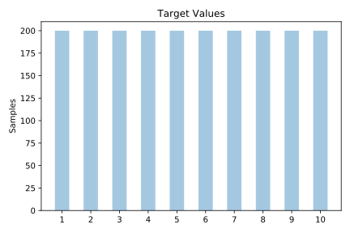
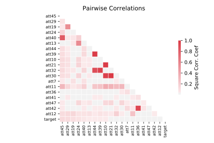

# mfeat_zernike

[Metadata](metadata.yaml) | [Summary Statistics](summary_stats.csv)

## Summary

**task**: classification

**instances**: 2000

**features**: 47

**number of classes**: 47

## Summary Plots

## Data Summary

|	variable	|	count	|	mean	|	std	|	min	|	25%	|	50%	|	75%	|	max|
| --- | --- | --- | --- | --- | --- | --- | --- | --- |
|	att1	|	2000	|	0	|	0	|	0	|	0	|	0	|	0	|	0
|	att2	|	2000	|	1	|	1	|	0	|	0	|	1	|	2	|	9
|	att3	|	2000	|	21	|	11	|	0	|	12	|	20	|	29	|	72
|	att4	|	2000	|	69	|	38	|	2	|	40	|	63	|	94	|	200
|	att5	|	2000	|	109	|	53	|	3	|	69	|	106	|	143	|	284
|	att6	|	2000	|	266	|	124	|	1	|	166	|	258	|	360	|	563
|	att7	|	2000	|	147	|	100	|	0	|	60	|	132	|	220	|	463
|	att8	|	2000	|	0	|	0	|	0	|	0	|	0	|	0	|	0
|	att9	|	2000	|	2	|	1	|	0	|	1	|	2	|	3	|	13
|	att10	|	2000	|	24	|	17	|	0	|	11	|	20	|	32	|	92
|	att11	|	2000	|	84	|	52	|	1	|	40	|	76	|	121	|	230
|	att12	|	2000	|	123	|	65	|	1	|	70	|	118	|	173	|	299
|	att13	|	2000	|	127	|	67	|	4	|	74	|	120	|	177	|	332
|	att14	|	2000	|	0	|	0	|	0	|	0	|	0	|	0	|	1
|	att15	|	2000	|	6	|	3	|	0	|	3	|	6	|	8	|	22
|	att16	|	2000	|	40	|	22	|	0	|	23	|	36	|	54	|	133
|	att17	|	2000	|	99	|	55	|	2	|	57	|	91	|	134	|	295
|	att18	|	2000	|	154	|	74	|	4	|	98	|	145	|	202	|	408
|	att19	|	2000	|	130	|	116	|	0	|	45	|	97	|	177	|	573
|	att20	|	2000	|	0	|	0	|	0	|	0	|	0	|	0	|	1
|	att21	|	2000	|	7	|	5	|	0	|	3	|	6	|	10	|	31
|	att22	|	2000	|	52	|	32	|	0	|	25	|	45	|	74	|	149
|	att23	|	2000	|	105	|	61	|	4	|	58	|	100	|	139	|	328
|	att24	|	2000	|	126	|	66	|	5	|	72	|	122	|	172	|	325
|	att25	|	2000	|	0	|	0	|	0	|	0	|	0	|	1	|	3
|	att26	|	2000	|	14	|	8	|	0	|	8	|	13	|	19	|	52
|	att27	|	2000	|	75	|	40	|	3	|	45	|	69	|	98	|	232
|	att28	|	2000	|	194	|	76	|	6	|	141	|	192	|	252	|	395
|	att29	|	2000	|	139	|	111	|	0	|	57	|	112	|	185	|	596
|	att30	|	2000	|	1	|	0	|	0	|	0	|	0	|	1	|	5
|	att31	|	2000	|	20	|	13	|	0	|	10	|	17	|	28	|	63
|	att32	|	2000	|	76	|	51	|	0	|	41	|	66	|	97	|	295
|	att33	|	2000	|	112	|	64	|	2	|	59	|	104	|	162	|	300
|	att34	|	2000	|	2	|	1	|	0	|	1	|	2	|	3	|	9
|	att35	|	2000	|	34	|	17	|	1	|	22	|	32	|	44	|	111
|	att36	|	2000	|	269	|	60	|	50	|	223	|	265	|	315	|	432
|	att37	|	2000	|	113	|	91	|	0	|	40	|	91	|	163	|	430
|	att38	|	2000	|	3	|	2	|	0	|	1	|	3	|	5	|	12
|	att39	|	2000	|	38	|	27	|	0	|	19	|	31	|	48	|	158
|	att40	|	2000	|	111	|	65	|	1	|	56	|	108	|	160	|	291
|	att41	|	2000	|	7	|	3	|	0	|	5	|	6	|	9	|	24
|	att42	|	2000	|	185	|	37	|	57	|	158	|	184	|	213	|	296
|	att43	|	2000	|	399	|	96	|	109	|	329	|	397	|	459	|	722
|	att44	|	2000	|	9	|	6	|	0	|	4	|	7	|	11	|	39
|	att45	|	2000	|	86	|	52	|	0	|	40	|	83	|	127	|	218
|	att46	|	2000	|	54	|	11	|	19	|	46	|	54	|	62	|	89
|	att47	|	2000	|	508	|	71	|	322	|	455	|	504	|	558	|	777
|	target	|	2000	|	5	|	2	|	1	|	3	|	5	|	8	|	10
