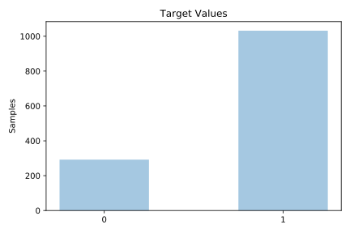
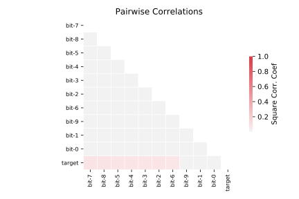

# mofn_3_7_10

[Metadata](metadata.yaml) | [Summary Statistics](summary_stats.csv)

## Summary

**task**: classification

**instances**: 1324

**features**: 10

**number of classes**: 10

## Summary Plots

## Data Summary

|	variable	|	count	|	mean	|	std	|	min	|	25%	|	50%	|	75%	|	max|
| --- | --- | --- | --- | --- | --- | --- | --- | --- |
|	Bit-0	|	1324	|	0	|	0	|	0	|	0	|	0	|	1	|	1
|	Bit-1	|	1324	|	0	|	0	|	0	|	0	|	0	|	1	|	1
|	Bit-2	|	1324	|	0	|	0	|	0	|	0	|	1	|	1	|	1
|	Bit-3	|	1324	|	0	|	0	|	0	|	0	|	0	|	1	|	1
|	Bit-4	|	1324	|	0	|	0	|	0	|	0	|	1	|	1	|	1
|	Bit-5	|	1324	|	0	|	0	|	0	|	0	|	1	|	1	|	1
|	Bit-6	|	1324	|	0	|	0	|	0	|	0	|	0	|	1	|	1
|	Bit-7	|	1324	|	0	|	0	|	0	|	0	|	0	|	1	|	1
|	Bit-8	|	1324	|	0	|	0	|	0	|	0	|	0	|	1	|	1
|	Bit-9	|	1324	|	0	|	0	|	0	|	0	|	0	|	1	|	1
|	target	|	1324	|	0	|	0	|	0	|	1	|	1	|	1	|	1
