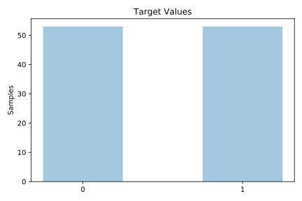
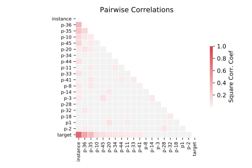

# molecular_biology_promoters

[Metadata](metadata.yaml) | [Summary Statistics](summary_stats.csv)

## Summary

**task**: classification

**instances**: 106

**features**: 58

**number of classes**: 58

## Summary Plots

## Data Summary

|	variable	|	count	|	mean	|	std	|	min	|	25%	|	50%	|	75%	|	max|
| --- | --- | --- | --- | --- | --- | --- | --- | --- |
|	instance	|	106	|	52	|	30	|	0	|	26	|	52	|	78	|	105
|	p-50	|	106	|	1	|	1	|	0	|	1	|	1	|	3	|	3
|	p-49	|	106	|	1	|	1	|	0	|	0	|	1	|	2	|	3
|	p-48	|	106	|	1	|	1	|	0	|	0	|	2	|	2	|	3
|	p-47	|	106	|	1	|	1	|	0	|	1	|	2	|	2	|	3
|	p-46	|	106	|	1	|	1	|	0	|	0	|	1	|	2	|	3
|	p-45	|	106	|	1	|	1	|	0	|	0	|	1	|	2	|	3
|	p-44	|	106	|	1	|	1	|	0	|	0	|	1	|	3	|	3
|	p-43	|	106	|	1	|	1	|	0	|	0	|	1	|	3	|	3
|	p-42	|	106	|	1	|	1	|	0	|	0	|	1	|	3	|	3
|	p-41	|	106	|	1	|	1	|	0	|	0	|	1	|	3	|	3
|	p-40	|	106	|	1	|	1	|	0	|	0	|	1	|	3	|	3
|	p-39	|	106	|	1	|	1	|	0	|	1	|	2	|	3	|	3
|	p-38	|	106	|	1	|	1	|	0	|	0	|	2	|	3	|	3
|	p-37	|	106	|	1	|	1	|	0	|	1	|	1	|	2	|	3
|	p-36	|	106	|	1	|	1	|	0	|	1	|	3	|	3	|	3
|	p-35	|	106	|	1	|	1	|	0	|	1	|	3	|	3	|	3
|	p-34	|	106	|	1	|	0	|	0	|	1	|	2	|	2	|	3
|	p-33	|	106	|	1	|	1	|	0	|	0	|	1	|	2	|	3
|	p-32	|	106	|	1	|	1	|	0	|	0	|	1	|	2	|	3
|	p-31	|	106	|	1	|	1	|	0	|	0	|	1	|	2	|	3
|	p-30	|	106	|	1	|	1	|	0	|	0	|	2	|	3	|	3
|	p-29	|	106	|	1	|	1	|	0	|	0	|	2	|	2	|	3
|	p-28	|	106	|	1	|	1	|	0	|	1	|	2	|	2	|	3
|	p-27	|	106	|	1	|	1	|	0	|	1	|	2	|	3	|	3
|	p-26	|	106	|	1	|	1	|	0	|	0	|	2	|	3	|	3
|	p-25	|	106	|	1	|	1	|	0	|	0	|	2	|	3	|	3
|	p-24	|	106	|	1	|	1	|	0	|	0	|	1	|	2	|	3
|	p-23	|	106	|	1	|	1	|	0	|	1	|	2	|	3	|	3
|	p-22	|	106	|	1	|	1	|	0	|	1	|	2	|	3	|	3
|	p-21	|	106	|	1	|	1	|	0	|	0	|	1	|	2	|	3
|	p-20	|	106	|	1	|	1	|	0	|	0	|	1	|	3	|	3
|	p-19	|	106	|	1	|	1	|	0	|	0	|	1	|	2	|	3
|	p-18	|	106	|	1	|	1	|	0	|	1	|	2	|	3	|	3
|	p-17	|	106	|	1	|	1	|	0	|	1	|	2	|	3	|	3
|	p-16	|	106	|	1	|	1	|	0	|	0	|	1	|	2	|	3
|	p-15	|	106	|	1	|	1	|	0	|	1	|	2	|	3	|	3
|	p-14	|	106	|	1	|	1	|	0	|	1	|	2	|	3	|	3
|	p-13	|	106	|	1	|	1	|	0	|	0	|	2	|	3	|	3
|	p-12	|	106	|	1	|	1	|	0	|	0	|	1	|	3	|	3
|	p-11	|	106	|	1	|	1	|	0	|	0	|	1	|	2	|	3
|	p-10	|	106	|	1	|	1	|	0	|	0	|	1	|	2	|	3
|	p-9	|	106	|	1	|	1	|	0	|	1	|	2	|	3	|	3
|	p-8	|	106	|	1	|	1	|	0	|	1	|	2	|	3	|	3
|	p-7	|	106	|	1	|	1	|	0	|	1	|	2	|	3	|	3
|	p-6	|	106	|	1	|	1	|	0	|	0	|	2	|	3	|	3
|	p-5	|	106	|	1	|	1	|	0	|	1	|	1	|	2	|	3
|	p-4	|	106	|	1	|	1	|	0	|	0	|	1	|	2	|	3
|	p-3	|	106	|	1	|	1	|	0	|	1	|	1	|	2	|	3
|	p-2	|	106	|	1	|	1	|	0	|	1	|	1	|	2	|	3
|	p-1	|	106	|	1	|	1	|	0	|	1	|	1	|	2	|	3
|	p1	|	106	|	1	|	1	|	0	|	0	|	1	|	2	|	3
|	p2	|	106	|	1	|	1	|	0	|	0	|	1	|	3	|	3
|	p3	|	106	|	1	|	1	|	0	|	1	|	2	|	3	|	3
|	p4	|	106	|	1	|	1	|	0	|	1	|	1	|	3	|	3
|	p5	|	106	|	1	|	1	|	0	|	1	|	1	|	2	|	3
|	p6	|	106	|	1	|	1	|	0	|	1	|	1	|	3	|	3
|	p7	|	106	|	1	|	1	|	0	|	0	|	2	|	3	|	3
|	target	|	106	|	0	|	0	|	0	|	0	|	0	|	1	|	1
