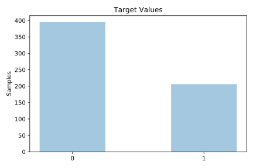
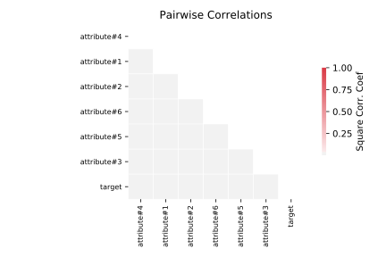

# monk2

[Metadata](metadata.yaml) | [Summary Statistics](summary_stats.csv)

## Summary

**task**: classification

**instances**: 601

**features**: 6

**number of classes**: 6

## Summary Plots

## Data Summary

|	variable	|	count	|	mean	|	std	|	min	|	25%	|	50%	|	75%	|	max|
| --- | --- | --- | --- | --- | --- | --- | --- | --- |
|	attribute#1	|	601	|	1	|	0	|	1	|	1	|	2	|	3	|	3
|	attribute#2	|	601	|	1	|	0	|	1	|	1	|	2	|	3	|	3
|	attribute#3	|	601	|	1	|	0	|	1	|	1	|	2	|	2	|	2
|	attribute#4	|	601	|	2	|	0	|	1	|	1	|	2	|	3	|	3
|	attribute#5	|	601	|	2	|	1	|	1	|	1	|	3	|	3	|	4
|	attribute#6	|	601	|	1	|	0	|	1	|	1	|	2	|	2	|	2
|	target	|	601	|	0	|	0	|	0	|	0	|	0	|	1	|	1
