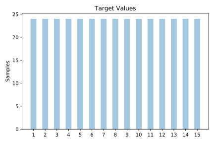
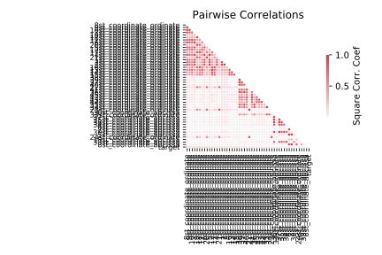

# movement_libras

[Metadata](metadata.yaml) | [Summary Statistics](summary_stats.csv)

## Summary

**task**: classification

**instances**: 360

**features**: 90

**number of classes**: 90

## Summary Plots

## Data Summary

|	variable	|	count	|	mean	|	std	|	min	|	25%	|	50%	|	75%	|	max|
| --- | --- | --- | --- | --- | --- | --- | --- | --- |
|	1st_coordinate_abcissa	|	360	|	0	|	0	|	0	|	0	|	0	|	0	|	0
|	1st_coordinate_ordinate	|	360	|	0	|	0	|	0	|	0	|	0	|	0	|	0
|	2st_coordinate_abcissa	|	360	|	0	|	0	|	0	|	0	|	0	|	0	|	0
|	2st_coordinate_ordinate	|	360	|	0	|	0	|	0	|	0	|	0	|	0	|	0
|	3st_coordinate_abcissa	|	360	|	0	|	0	|	0	|	0	|	0	|	0	|	0
|	3st_coordinate_ordinate	|	360	|	0	|	0	|	0	|	0	|	0	|	0	|	0
|	4st_coordinate_abcissa	|	360	|	0	|	0	|	0	|	0	|	0	|	0	|	0
|	4st_coordinate_ordinate	|	360	|	0	|	0	|	0	|	0	|	0	|	0	|	0
|	5st_coordinate_abcissa	|	360	|	0	|	0	|	0	|	0	|	0	|	0	|	0
|	5st_coordinate_ordinate	|	360	|	0	|	0	|	0	|	0	|	0	|	0	|	0
|	6st_coordinate_abcissa	|	360	|	0	|	0	|	0	|	0	|	0	|	0	|	0
|	6st_coordinate_ordinate	|	360	|	0	|	0	|	0	|	0	|	0	|	0	|	0
|	7st_coordinate_abcissa	|	360	|	0	|	0	|	0	|	0	|	0	|	0	|	0
|	7st_coordinate_ordinate	|	360	|	0	|	0	|	0	|	0	|	0	|	0	|	0
|	8st_coordinate_abcissa	|	360	|	0	|	0	|	0	|	0	|	0	|	0	|	0
|	8st_coordinate_ordinate	|	360	|	0	|	0	|	0	|	0	|	0	|	0	|	0
|	9st_coordinate_abcissa	|	360	|	0	|	0	|	0	|	0	|	0	|	0	|	0
|	9st_coordinate_ordinate	|	360	|	0	|	0	|	0	|	0	|	0	|	0	|	0
|	10st_coordinate_abcissa	|	360	|	0	|	0	|	0	|	0	|	0	|	0	|	0
|	10st_coordinate_ordinate	|	360	|	0	|	0	|	0	|	0	|	0	|	0	|	0
|	11st_coordinate_abcissa	|	360	|	0	|	0	|	0	|	0	|	0	|	0	|	0
|	11st_coordinate_ordinate	|	360	|	0	|	0	|	0	|	0	|	0	|	0	|	0
|	12st_coordinate_abcissa	|	360	|	0	|	0	|	0	|	0	|	0	|	0	|	0
|	12st_coordinate_ordinate	|	360	|	0	|	0	|	0	|	0	|	0	|	0	|	0
|	13st_coordinate_abcissa	|	360	|	0	|	0	|	0	|	0	|	0	|	0	|	0
|	13st_coordinate_ordinate	|	360	|	0	|	0	|	0	|	0	|	0	|	0	|	1
|	14st_coordinate_abcissa	|	360	|	0	|	0	|	0	|	0	|	0	|	0	|	0
|	14st_coordinate_ordinate	|	360	|	0	|	0	|	0	|	0	|	0	|	0	|	0
|	15st_coordinate_abcissa	|	360	|	0	|	0	|	0	|	0	|	0	|	0	|	0
|	15st_coordinate_ordinate	|	360	|	0	|	0	|	0	|	0	|	0	|	0	|	0
|	16st_coordinate_abcissa	|	360	|	0	|	0	|	0	|	0	|	0	|	0	|	0
|	16st_coordinate_ordinate	|	360	|	0	|	0	|	0	|	0	|	0	|	0	|	0
|	17st_coordinate_abcissa	|	360	|	0	|	0	|	0	|	0	|	0	|	0	|	0
|	17st_coordinate_ordinate	|	360	|	0	|	0	|	0	|	0	|	0	|	0	|	0
|	18st_coordinate_abcissa	|	360	|	0	|	0	|	0	|	0	|	0	|	0	|	0
|	18st_coordinate_ordinate	|	360	|	0	|	0	|	0	|	0	|	0	|	0	|	0
|	19st_coordinate_abcissa	|	360	|	0	|	0	|	0	|	0	|	0	|	0	|	0
|	19st_coordinate_ordinate	|	360	|	0	|	0	|	0	|	0	|	0	|	0	|	0
|	20st_coordinate_abcissa	|	360	|	0	|	0	|	0	|	0	|	0	|	0	|	0
|	20st_coordinate_ordinate	|	360	|	0	|	0	|	0	|	0	|	0	|	0	|	0
|	21st_coordinate_abcissa	|	360	|	0	|	0	|	0	|	0	|	0	|	0	|	0
|	21st_coordinate_ordinate	|	360	|	0	|	0	|	0	|	0	|	0	|	0	|	0
|	22st_coordinate_abcissa	|	360	|	0	|	0	|	0	|	0	|	0	|	0	|	0
|	22st_coordinate_ordinate	|	360	|	0	|	0	|	0	|	0	|	0	|	0	|	0
|	23st_coordinate_abcissa	|	360	|	0	|	0	|	0	|	0	|	0	|	0	|	0
|	23st_coordinate_ordinate	|	360	|	0	|	0	|	0	|	0	|	0	|	0	|	0
|	24st_coordinate_abcissa	|	360	|	0	|	0	|	0	|	0	|	0	|	0	|	0
|	24st_coordinate_ordinate	|	360	|	0	|	0	|	0	|	0	|	0	|	0	|	0
|	25st_coordinate_abcissa	|	360	|	0	|	0	|	0	|	0	|	0	|	0	|	0
|	25st_coordinate_ordinate	|	360	|	0	|	0	|	0	|	0	|	0	|	0	|	0
|	26st_coordinate_abcissa	|	360	|	0	|	0	|	0	|	0	|	0	|	0	|	0
|	26st_coordinate_ordinate	|	360	|	0	|	0	|	0	|	0	|	0	|	0	|	0
|	27st_coordinate_abcissa	|	360	|	0	|	0	|	0	|	0	|	0	|	0	|	0
|	27st_coordinate_ordinate	|	360	|	0	|	0	|	0	|	0	|	0	|	0	|	0
|	28st_coordinate_abcissa	|	360	|	0	|	0	|	0	|	0	|	0	|	0	|	0
|	28st_coordinate_ordinate	|	360	|	0	|	0	|	0	|	0	|	0	|	0	|	0
|	29st_coordinate_abcissa	|	360	|	0	|	0	|	0	|	0	|	0	|	0	|	0
|	29st_coordinate_ordinate	|	360	|	0	|	0	|	0	|	0	|	0	|	0	|	0
|	30st_coordinate_abcissa	|	360	|	0	|	0	|	0	|	0	|	0	|	0	|	0
|	30st_coordinate_ordinate	|	360	|	0	|	0	|	0	|	0	|	0	|	0	|	0
|	31st_coordinate_abcissa	|	360	|	0	|	0	|	0	|	0	|	0	|	0	|	0
|	31st_coordinate_ordinate	|	360	|	0	|	0	|	0	|	0	|	0	|	0	|	0
|	32st_coordinate_abcissa	|	360	|	0	|	0	|	0	|	0	|	0	|	0	|	0
|	32st_coordinate_ordinate	|	360	|	0	|	0	|	0	|	0	|	0	|	0	|	0
|	33st_coordinate_abcissa	|	360	|	0	|	0	|	0	|	0	|	0	|	0	|	0
|	33st_coordinate_ordinate	|	360	|	0	|	0	|	0	|	0	|	0	|	0	|	0
|	34st_coordinate_abcissa	|	360	|	0	|	0	|	0	|	0	|	0	|	0	|	0
|	34st_coordinate_ordinate	|	360	|	0	|	0	|	0	|	0	|	0	|	0	|	0
|	35st_coordinate_abcissa	|	360	|	0	|	0	|	0	|	0	|	0	|	0	|	0
|	35st_coordinate_ordinate	|	360	|	0	|	0	|	0	|	0	|	0	|	0	|	0
|	36st_coordinate_abcissa	|	360	|	0	|	0	|	0	|	0	|	0	|	0	|	0
|	36st_coordinate_ordinate	|	360	|	0	|	0	|	0	|	0	|	0	|	0	|	0
|	37st_coordinate_abcissa	|	360	|	0	|	0	|	0	|	0	|	0	|	0	|	0
|	37st_coordinate_ordinate	|	360	|	0	|	0	|	0	|	0	|	0	|	0	|	0
|	38st_coordinate_abcissa	|	360	|	0	|	0	|	0	|	0	|	0	|	0	|	0
|	38st_coordinate_ordinate	|	360	|	0	|	0	|	0	|	0	|	0	|	0	|	0
|	39st_coordinate_abcissa	|	360	|	0	|	0	|	0	|	0	|	0	|	0	|	0
|	39st_coordinate_ordinate	|	360	|	0	|	0	|	0	|	0	|	0	|	0	|	0
|	40st_coordinate_abcissa	|	360	|	0	|	0	|	0	|	0	|	0	|	0	|	0
|	40st_coordinate_ordinate	|	360	|	0	|	0	|	0	|	0	|	0	|	0	|	0
|	41st_coordinate_abcissa	|	360	|	0	|	0	|	0	|	0	|	0	|	0	|	0
|	41st_coordinate_ordinate	|	360	|	0	|	0	|	0	|	0	|	0	|	0	|	0
|	42st_coordinate_abcissa	|	360	|	0	|	0	|	0	|	0	|	0	|	0	|	0
|	42st_coordinate_ordinate	|	360	|	0	|	0	|	0	|	0	|	0	|	0	|	0
|	43st_coordinate_abcissa	|	360	|	0	|	0	|	0	|	0	|	0	|	0	|	0
|	43st_coordinate_ordinate	|	360	|	0	|	0	|	0	|	0	|	0	|	0	|	0
|	44st_coordinate_abcissa	|	360	|	0	|	0	|	0	|	0	|	0	|	0	|	0
|	44st_coordinate_ordinate	|	360	|	0	|	0	|	0	|	0	|	0	|	0	|	0
|	45st_coordinate_abcissa	|	360	|	0	|	0	|	0	|	0	|	0	|	0	|	1
|	45st_coordinate_ordinate	|	360	|	0	|	0	|	0	|	0	|	0	|	0	|	0
|	target	|	360	|	8	|	4	|	1	|	4	|	8	|	12	|	15
