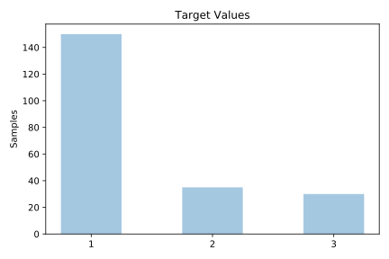
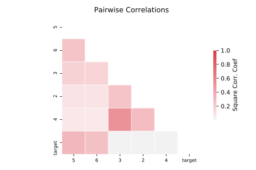

# new_thyroid

[Metadata](metadata.yaml) | [Summary Statistics](summary_stats.csv)

## Summary

**task**: classification

**instances**: 215

**features**: 5

**number of classes**: 5

## Summary Plots

## Data Summary

|	variable	|	count	|	mean	|	std	|	min	|	25%	|	50%	|	75%	|	max|
| --- | --- | --- | --- | --- | --- | --- | --- | --- |
|	2	|	215	|	109	|	13	|	65	|	103	|	110	|	117	|	144
|	3	|	215	|	9	|	4	|	0	|	7	|	9	|	11	|	25
|	4	|	215	|	2	|	1	|	0	|	1	|	1	|	2	|	10
|	5	|	215	|	2	|	6	|	0	|	1	|	1	|	1	|	56
|	6	|	215	|	4	|	8	|	0	|	0	|	2	|	4	|	56
|	target	|	215	|	1	|	0	|	1	|	1	|	1	|	2	|	3
