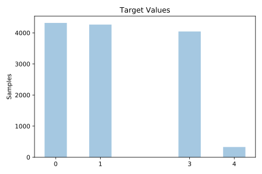
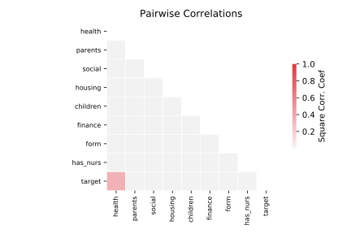

# nursery

[Metadata](metadata.yaml) | [Summary Statistics](summary_stats.csv)

## Summary

**task**: classification

**instances**: 12958

**features**: 8

**number of classes**: 8

## Summary Plots

## Data Summary

|	variable	|	count	|	mean	|	std	|	min	|	25%	|	50%	|	75%	|	max|
| --- | --- | --- | --- | --- | --- | --- | --- | --- |
|	parents	|	12958	|	0	|	0	|	0	|	0	|	1	|	2	|	2
|	has_nurs	|	12958	|	1	|	1	|	0	|	1	|	2	|	3	|	4
|	form	|	12958	|	1	|	1	|	0	|	1	|	2	|	2	|	3
|	children	|	12958	|	1	|	1	|	0	|	1	|	2	|	2	|	3
|	housing	|	12958	|	1	|	0	|	0	|	0	|	1	|	2	|	2
|	finance	|	12958	|	0	|	0	|	0	|	0	|	1	|	1	|	1
|	social	|	12958	|	1	|	0	|	0	|	0	|	1	|	2	|	2
|	health	|	12958	|	0	|	0	|	0	|	0	|	1	|	2	|	2
|	target	|	12958	|	1	|	1	|	0	|	0	|	1	|	3	|	4
