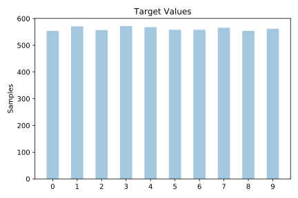
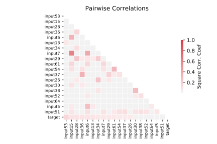

# optdigits

[Metadata](metadata.yaml) | [Summary Statistics](summary_stats.csv)

## Summary

**task**: classification

**instances**: 5620

**features**: 64

**number of classes**: 64

## Summary Plots

## Data Summary

|	variable	|	count	|	mean	|	std	|	min	|	25%	|	50%	|	75%	|	max|
| --- | --- | --- | --- | --- | --- | --- | --- | --- |
|	input1	|	5620	|	0	|	0	|	0	|	0	|	0	|	0	|	0
|	input2	|	5620	|	0	|	0	|	0	|	0	|	0	|	0	|	8
|	input3	|	5620	|	5	|	4	|	0	|	1	|	5	|	9	|	16
|	input4	|	5620	|	11	|	4	|	0	|	10	|	13	|	15	|	16
|	input5	|	5620	|	11	|	4	|	0	|	9	|	13	|	15	|	16
|	input6	|	5620	|	5	|	5	|	0	|	0	|	4	|	10	|	16
|	input7	|	5620	|	1	|	3	|	0	|	0	|	0	|	0	|	16
|	input8	|	5620	|	0	|	1	|	0	|	0	|	0	|	0	|	16
|	input9	|	5620	|	0	|	0	|	0	|	0	|	0	|	0	|	5
|	input10	|	5620	|	1	|	3	|	0	|	0	|	0	|	3	|	16
|	input11	|	5620	|	10	|	5	|	0	|	6	|	12	|	15	|	16
|	input12	|	5620	|	11	|	4	|	0	|	9	|	13	|	15	|	16
|	input13	|	5620	|	10	|	4	|	0	|	7	|	11	|	15	|	16
|	input14	|	5620	|	8	|	5	|	0	|	2	|	9	|	14	|	16
|	input15	|	5620	|	2	|	3	|	0	|	0	|	0	|	2	|	16
|	input16	|	5620	|	0	|	0	|	0	|	0	|	0	|	0	|	15
|	input17	|	5620	|	0	|	0	|	0	|	0	|	0	|	0	|	5
|	input18	|	5620	|	2	|	3	|	0	|	0	|	1	|	4	|	16
|	input19	|	5620	|	9	|	5	|	0	|	4	|	12	|	15	|	16
|	input20	|	5620	|	6	|	5	|	0	|	1	|	6	|	12	|	16
|	input21	|	5620	|	7	|	6	|	0	|	1	|	6	|	13	|	16
|	input22	|	5620	|	7	|	6	|	0	|	0	|	9	|	14	|	16
|	input23	|	5620	|	1	|	3	|	0	|	0	|	0	|	3	|	16
|	input24	|	5620	|	0	|	0	|	0	|	0	|	0	|	0	|	8
|	input25	|	5620	|	0	|	0	|	0	|	0	|	0	|	0	|	1
|	input26	|	5620	|	2	|	3	|	0	|	0	|	1	|	4	|	16
|	input27	|	5620	|	9	|	6	|	0	|	3	|	11	|	15	|	16
|	input28	|	5620	|	9	|	5	|	0	|	4	|	10	|	15	|	16
|	input29	|	5620	|	9	|	6	|	0	|	3	|	12	|	16	|	16
|	input30	|	5620	|	7	|	5	|	0	|	1	|	8	|	14	|	16
|	input31	|	5620	|	2	|	3	|	0	|	0	|	0	|	4	|	16
|	input32	|	5620	|	0	|	0	|	0	|	0	|	0	|	0	|	2
|	input33	|	5620	|	0	|	0	|	0	|	0	|	0	|	0	|	1
|	input34	|	5620	|	2	|	3	|	0	|	0	|	0	|	4	|	15
|	input35	|	5620	|	7	|	6	|	0	|	0	|	8	|	14	|	16
|	input36	|	5620	|	9	|	6	|	0	|	3	|	11	|	16	|	16
|	input37	|	5620	|	10	|	5	|	0	|	6	|	13	|	16	|	16
|	input38	|	5620	|	9	|	5	|	0	|	4	|	10	|	15	|	16
|	input39	|	5620	|	2	|	3	|	0	|	0	|	1	|	6	|	14
|	input40	|	5620	|	0	|	0	|	0	|	0	|	0	|	0	|	0
|	input41	|	5620	|	0	|	0	|	0	|	0	|	0	|	0	|	7
|	input42	|	5620	|	1	|	2	|	0	|	0	|	0	|	2	|	16
|	input43	|	5620	|	6	|	6	|	0	|	0	|	4	|	14	|	16
|	input44	|	5620	|	7	|	6	|	0	|	0	|	7	|	14	|	16
|	input45	|	5620	|	7	|	6	|	0	|	1	|	8	|	14	|	16
|	input46	|	5620	|	8	|	5	|	0	|	3	|	9	|	14	|	16
|	input47	|	5620	|	3	|	4	|	0	|	0	|	1	|	7	|	16
|	input48	|	5620	|	0	|	0	|	0	|	0	|	0	|	0	|	6
|	input49	|	5620	|	0	|	0	|	0	|	0	|	0	|	0	|	10
|	input50	|	5620	|	0	|	1	|	0	|	0	|	0	|	0	|	16
|	input51	|	5620	|	7	|	5	|	0	|	2	|	8	|	13	|	16
|	input52	|	5620	|	9	|	5	|	0	|	6	|	10	|	15	|	16
|	input53	|	5620	|	9	|	5	|	0	|	5	|	10	|	15	|	16
|	input54	|	5620	|	9	|	5	|	0	|	3	|	11	|	15	|	16
|	input55	|	5620	|	3	|	4	|	0	|	0	|	1	|	7	|	16
|	input56	|	5620	|	0	|	0	|	0	|	0	|	0	|	0	|	13
|	input57	|	5620	|	0	|	0	|	0	|	0	|	0	|	0	|	1
|	input58	|	5620	|	0	|	0	|	0	|	0	|	0	|	0	|	10
|	input59	|	5620	|	5	|	5	|	0	|	1	|	5	|	10	|	16
|	input60	|	5620	|	11	|	4	|	0	|	10	|	13	|	15	|	16
|	input61	|	5620	|	11	|	4	|	0	|	9	|	13	|	16	|	16
|	input62	|	5620	|	6	|	5	|	0	|	0	|	6	|	12	|	16
|	input63	|	5620	|	2	|	4	|	0	|	0	|	0	|	2	|	16
|	input64	|	5620	|	0	|	1	|	0	|	0	|	0	|	0	|	16
|	target	|	5620	|	4	|	2	|	0	|	2	|	4	|	7	|	9
