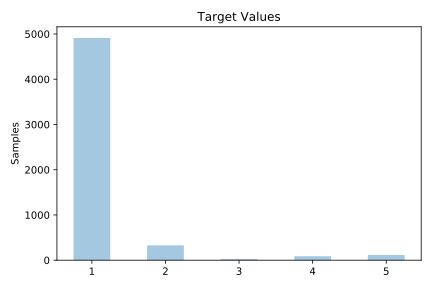
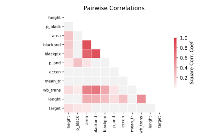

# page_blocks

[Metadata](metadata.yaml) | [Summary Statistics](summary_stats.csv)

## Summary

**task**: classification

**instances**: 5473

**features**: 10

**number of classes**: 10

## Summary Plots

## Data Summary

|	variable	|	count	|	mean	|	std	|	min	|	25%	|	50%	|	75%	|	max|
| --- | --- | --- | --- | --- | --- | --- | --- | --- |
|	height	|	5473	|	10	|	18	|	1	|	7	|	8	|	10	|	804
|	lenght	|	5473	|	89	|	114	|	1	|	17	|	41	|	107	|	553
|	area	|	5473	|	1198	|	4849	|	7	|	114	|	322	|	980	|	143993
|	eccen	|	5473	|	13	|	30	|	0	|	2	|	5	|	13	|	537
|	p_black	|	5473	|	0	|	0	|	0	|	0	|	0	|	0	|	1
|	p_and	|	5473	|	0	|	0	|	0	|	0	|	0	|	0	|	1
|	mean_tr	|	5473	|	6	|	69	|	1	|	1	|	2	|	3	|	4955
|	blackpix	|	5473	|	365	|	1270	|	7	|	42	|	108	|	284	|	33017
|	blackand	|	5473	|	741	|	1881	|	7	|	95	|	250	|	718	|	46133
|	wb_trans	|	5473	|	106	|	167	|	1	|	17	|	49	|	126	|	3212
|	target	|	5473	|	1	|	0	|	1	|	1	|	1	|	1	|	5
