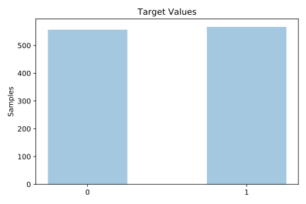
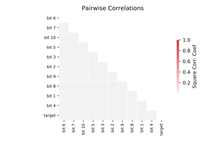

# parity5+5

[Metadata](metadata.yaml) | [Summary Statistics](summary_stats.csv)

## Summary

**task**: classification

**instances**: 1124

**features**: 10

**number of classes**: 10

## Summary Plots

## Data Summary

|	variable	|	count	|	mean	|	std	|	min	|	25%	|	50%	|	75%	|	max|
| --- | --- | --- | --- | --- | --- | --- | --- | --- |
|	Bit 1	|	1124	|	0	|	0	|	0	|	0	|	0	|	1	|	1
|	Bit 2	|	1124	|	0	|	0	|	0	|	0	|	0	|	1	|	1
|	Bit 3	|	1124	|	0	|	0	|	0	|	0	|	1	|	1	|	1
|	Bit 4	|	1124	|	0	|	0	|	0	|	0	|	1	|	1	|	1
|	Bit 5	|	1124	|	0	|	0	|	0	|	0	|	0	|	1	|	1
|	Bit 6	|	1124	|	0	|	0	|	0	|	0	|	0	|	1	|	1
|	Bit 7	|	1124	|	0	|	0	|	0	|	0	|	0	|	1	|	1
|	Bit 8	|	1124	|	0	|	0	|	0	|	0	|	0	|	1	|	1
|	Bit 9	|	1124	|	0	|	0	|	0	|	0	|	1	|	1	|	1
|	Bit 10	|	1124	|	0	|	0	|	0	|	0	|	0	|	1	|	1
|	target	|	1124	|	0	|	0	|	0	|	0	|	1	|	1	|	1
