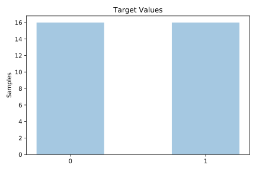
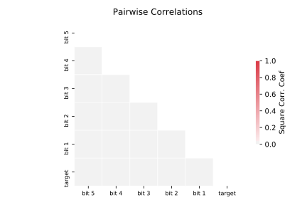

# parity5

[Metadata](metadata.yaml) | [Summary Statistics](summary_stats.csv)

## Summary

**task**: classification

**instances**: 32

**features**: 5

**number of classes**: 5

## Summary Plots

## Data Summary

|	variable	|	count	|	mean	|	std	|	min	|	25%	|	50%	|	75%	|	max|
| --- | --- | --- | --- | --- | --- | --- | --- | --- |
|	Bit 1	|	32	|	0	|	0	|	0	|	0	|	0	|	1	|	1
|	Bit 2	|	32	|	0	|	0	|	0	|	0	|	0	|	1	|	1
|	Bit 3	|	32	|	0	|	0	|	0	|	0	|	0	|	1	|	1
|	Bit 4	|	32	|	0	|	0	|	0	|	0	|	0	|	1	|	1
|	Bit 5	|	32	|	0	|	0	|	0	|	0	|	0	|	1	|	1
|	target	|	32	|	0	|	0	|	0	|	0	|	0	|	1	|	1
