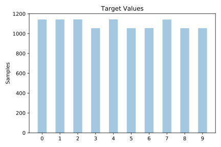

# pendigits

[Metadata](metadata.yaml) | [Summary Statistics](summary_stats.csv)

## Summary

**task**: classification

**instances**: 10992

**features**: 16

**number of classes**: 16

## Summary Plots

## Data Summary

|	variable	|	count	|	mean	|	std	|	min	|	25%	|	50%	|	75%	|	max|
| --- | --- | --- | --- | --- | --- | --- | --- | --- |
|	input1	|	10992	|	38	|	34	|	0	|	6	|	32	|	65	|	100
|	input2	|	10992	|	85	|	16	|	0	|	76	|	89	|	100	|	100
|	input3	|	10992	|	40	|	26	|	0	|	20	|	40	|	58	|	100
|	input4	|	10992	|	83	|	19	|	0	|	72	|	91	|	100	|	100
|	input5	|	10992	|	49	|	34	|	0	|	18	|	53	|	78	|	100
|	input6	|	10992	|	65	|	26	|	0	|	49	|	71	|	86	|	100
|	input7	|	10992	|	51	|	30	|	0	|	28	|	53	|	74	|	100
|	input8	|	10992	|	44	|	29	|	0	|	23	|	43	|	64	|	100
|	input9	|	10992	|	56	|	34	|	0	|	29	|	60	|	89	|	100
|	input10	|	10992	|	33	|	27	|	0	|	7	|	33	|	54	|	100
|	input11	|	10992	|	60	|	37	|	0	|	23	|	73	|	97	|	100
|	input12	|	10992	|	34	|	27	|	0	|	11	|	30	|	55	|	100
|	input13	|	10992	|	55	|	22	|	0	|	42	|	53	|	68	|	100
|	input14	|	10992	|	34	|	33	|	0	|	5	|	27	|	47	|	100
|	input15	|	10992	|	47	|	41	|	0	|	0	|	40	|	100	|	100
|	input16	|	10992	|	28	|	35	|	0	|	0	|	9	|	51	|	100
|	target	|	10992	|	4	|	2	|	0	|	2	|	4	|	7	|	9
