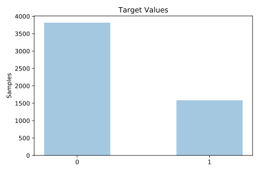
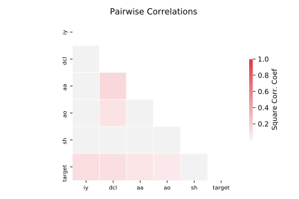

# phoneme

[Metadata](metadata.yaml) | [Summary Statistics](summary_stats.csv)

## Summary

**task**: classification

**instances**: 5404

**features**: 5

**number of classes**: 5

## Summary Plots

## Data Summary

|	variable	|	count	|	mean	|	std	|	min	|	25%	|	50%	|	75%	|	max|
| --- | --- | --- | --- | --- | --- | --- | --- | --- |
|	Aa	|	5404	|	0	|	0	|	-1	|	0	|	0	|	1	|	4
|	Ao	|	5404	|	1	|	0	|	-1	|	0	|	1	|	1	|	4
|	Dcl	|	5404	|	0	|	0	|	-1	|	0	|	0	|	1	|	3
|	Iy	|	5404	|	0	|	0	|	-1	|	0	|	0	|	0	|	2
|	Sh	|	5404	|	0	|	0	|	-1	|	0	|	0	|	0	|	2
|	target	|	5404	|	0	|	0	|	0	|	0	|	0	|	1	|	1
