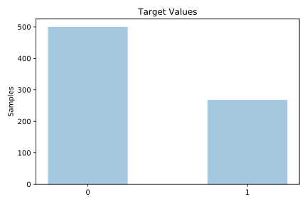
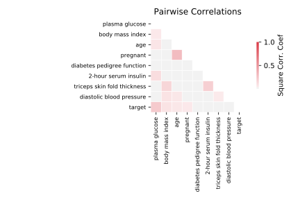

# pima

[Metadata](metadata.yaml) | [Summary Statistics](summary_stats.csv)

## Summary

**task**: classification

**instances**: 768

**features**: 8

**number of classes**: 8

## Summary Plots

## Data Summary

|	variable	|	count	|	mean	|	std	|	min	|	25%	|	50%	|	75%	|	max|
| --- | --- | --- | --- | --- | --- | --- | --- | --- |
|	Pregnant	|	768	|	3	|	3	|	0	|	1	|	3	|	6	|	17
|	plasma glucose	|	768	|	120	|	31	|	0	|	99	|	117	|	140	|	199
|	Diastolic blood pressure	|	768	|	69	|	19	|	0	|	62	|	72	|	80	|	122
|	Triceps skin fold thickness	|	768	|	20	|	15	|	0	|	0	|	23	|	32	|	99
|	2-Hour serum insulin	|	768	|	79	|	115	|	0	|	0	|	30	|	127	|	846
|	Body mass index	|	768	|	31	|	7	|	0	|	27	|	32	|	36	|	67
|	Diabetes pedigree function	|	768	|	0	|	0	|	0	|	0	|	0	|	0	|	2
|	Age	|	768	|	33	|	11	|	21	|	24	|	29	|	41	|	81
|	target	|	768	|	0	|	0	|	0	|	0	|	0	|	1	|	1
