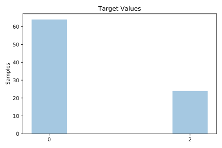
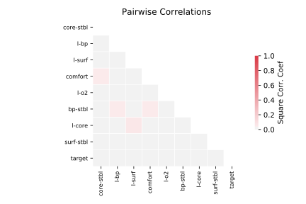

# postoperative_patient_data

[Metadata](metadata.yaml) | [Summary Statistics](summary_stats.csv)

## Summary

**task**: classification

**instances**: 88

**features**: 8

**number of classes**: 8

## Summary Plots

## Data Summary

|	variable	|	count	|	mean	|	std	|	min	|	25%	|	50%	|	75%	|	max|
| --- | --- | --- | --- | --- | --- | --- | --- | --- |
|	L-CORE	|	88	|	1	|	0	|	0	|	1	|	2	|	2	|	2
|	L-SURF	|	88	|	1	|	0	|	0	|	1	|	2	|	2	|	2
|	L-O2	|	88	|	0	|	0	|	0	|	0	|	1	|	1	|	1
|	L-BP	|	88	|	1	|	0	|	0	|	0	|	2	|	2	|	2
|	SURF-STBL	|	88	|	0	|	0	|	0	|	0	|	0	|	1	|	1
|	CORE-STBL	|	88	|	1	|	0	|	0	|	1	|	1	|	1	|	2
|	BP-STBL	|	88	|	1	|	0	|	0	|	1	|	1	|	1	|	2
|	COMFORT	|	88	|	2	|	0	|	0	|	2	|	2	|	2	|	4
|	target	|	88	|	0	|	0	|	0	|	0	|	0	|	2	|	2
