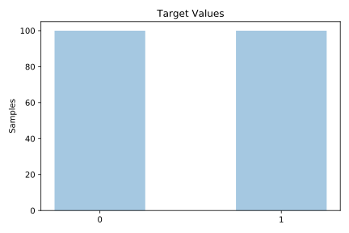
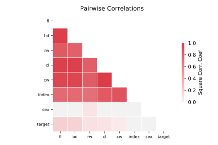

# prnn_crabs

[Metadata](metadata.yaml) | [Summary Statistics](summary_stats.csv)

## Summary

**task**: classification

**instances**: 200

**features**: 7

**number of classes**: 7

## Summary Plots

## Data Summary

|	variable	|	count	|	mean	|	std	|	min	|	25%	|	50%	|	75%	|	max|
| --- | --- | --- | --- | --- | --- | --- | --- | --- |
|	sex	|	200	|	0	|	0	|	0	|	0	|	0	|	1	|	1
|	index	|	200	|	25	|	14	|	1	|	13	|	25	|	38	|	50
|	FL	|	200	|	15	|	3	|	7	|	12	|	15	|	18	|	23
|	RW	|	200	|	12	|	2	|	6	|	11	|	12	|	14	|	20
|	CL	|	200	|	32	|	7	|	14	|	27	|	32	|	37	|	47
|	CW	|	200	|	36	|	7	|	17	|	31	|	36	|	42	|	54
|	BD	|	200	|	14	|	3	|	6	|	11	|	13	|	16	|	21
|	target	|	200	|	0	|	0	|	0	|	0	|	0	|	1	|	1
