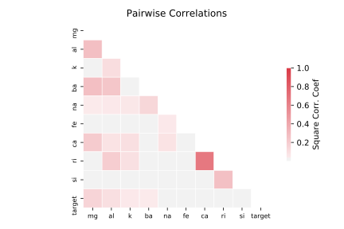

# prnn_fglass

[Metadata](metadata.yaml) | [Summary Statistics](summary_stats.csv)

## Summary

**task**: classification

**instances**: 205

**features**: 9

**number of classes**: 9

## Summary Plots

## Data Summary

|	variable	|	count	|	mean	|	std	|	min	|	25%	|	50%	|	75%	|	max|
| --- | --- | --- | --- | --- | --- | --- | --- | --- |
|	RI	|	205	|	1	|	0	|	1	|	1	|	1	|	1	|	1
|	Na	|	205	|	13	|	0	|	10	|	12	|	13	|	13	|	15
|	Mg	|	205	|	2	|	1	|	0	|	2	|	3	|	3	|	4
|	Al	|	205	|	1	|	0	|	0	|	1	|	1	|	1	|	3
|	Si	|	205	|	72	|	0	|	69	|	72	|	72	|	73	|	75
|	K	|	205	|	0	|	0	|	0	|	0	|	0	|	0	|	6
|	Ca	|	205	|	8	|	1	|	5	|	8	|	8	|	9	|	16
|	Ba	|	205	|	0	|	0	|	0	|	0	|	0	|	0	|	3
|	Fe	|	205	|	0	|	0	|	0	|	0	|	0	|	0	|	0
|	target	|	205	|	3	|	1	|	0	|	3	|	4	|	5	|	5
