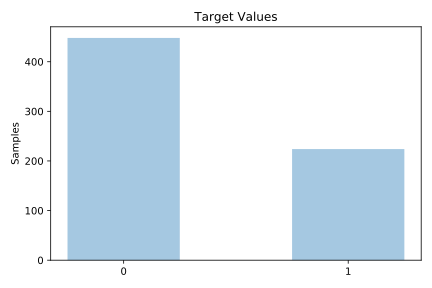
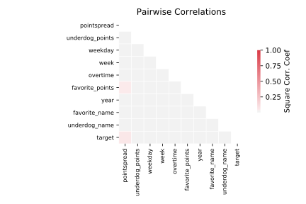

# profb

[Metadata](metadata.yaml) | [Summary Statistics](summary_stats.csv)

## Summary

**task**: classification

**instances**: 672

**features**: 9

**number of classes**: 9

## Summary Plots

## Data Summary

|	variable	|	count	|	mean	|	std	|	min	|	25%	|	50%	|	75%	|	max|
| --- | --- | --- | --- | --- | --- | --- | --- | --- |
|	Overtime	|	672	|	0	|	0	|	0	|	0	|	0	|	0	|	1
|	Favorite_Points	|	672	|	22	|	9	|	0	|	16	|	23	|	29	|	61
|	Underdog_Points	|	672	|	16	|	9	|	0	|	10	|	16	|	23	|	47
|	Pointspread	|	672	|	5	|	3	|	0	|	3	|	5	|	7	|	19
|	Favorite_Name	|	672	|	13	|	8	|	0	|	6	|	14	|	20	|	27
|	Underdog_name	|	672	|	13	|	7	|	0	|	7	|	13	|	21	|	27
|	Year	|	672	|	90	|	0	|	89	|	89	|	90	|	91	|	91
|	Week	|	672	|	8	|	4	|	1	|	5	|	9	|	13	|	17
|	Weekday	|	672	|	0	|	0	|	0	|	0	|	0	|	0	|	3
|	target	|	672	|	0	|	0	|	0	|	0	|	0	|	1	|	1
