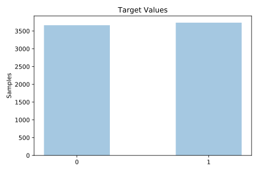
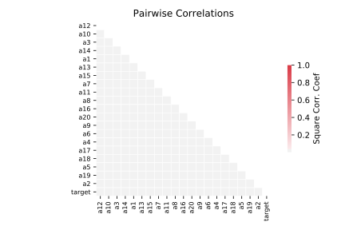

# ring

[Metadata](metadata.yaml) | [Summary Statistics](summary_stats.csv)

## Summary

**task**: classification

**instances**: 7400

**features**: 20

**number of classes**: 20

## Summary Plots

## Data Summary

|	variable	|	count	|	mean	|	std	|	min	|	25%	|	50%	|	75%	|	max|
| --- | --- | --- | --- | --- | --- | --- | --- | --- |
|	A1	|	7400	|	211	|	1486	|	-6879	|	-495	|	159	|	1072	|	6285
|	A2	|	7400	|	225	|	1499	|	-7141	|	-518	|	173	|	1109	|	6921
|	A3	|	7400	|	185	|	1542	|	-7734	|	-581	|	152	|	1058	|	7611
|	A4	|	7400	|	219	|	1490	|	-6627	|	-512	|	152	|	1097	|	7149
|	A5	|	7400	|	190	|	1489	|	-7184	|	-548	|	148	|	1069	|	6383
|	A6	|	7400	|	200	|	1512	|	-6946	|	-522	|	151	|	1080	|	6743
|	A7	|	7400	|	201	|	1519	|	-7781	|	-524	|	145	|	1077	|	6285
|	A8	|	7400	|	222	|	1481	|	-6882	|	-466	|	168	|	1082	|	6357
|	A9	|	7400	|	187	|	1534	|	-7184	|	-523	|	157	|	1069	|	7487
|	A10	|	7400	|	223	|	1483	|	-7232	|	-477	|	172	|	1081	|	6757
|	A11	|	7400	|	215	|	1516	|	-7803	|	-534	|	172	|	1116	|	7208
|	A12	|	7400	|	202	|	1503	|	-7395	|	-515	|	165	|	1074	|	6791
|	A13	|	7400	|	194	|	1512	|	-7096	|	-518	|	156	|	1065	|	6403
|	A14	|	7400	|	183	|	1485	|	-7472	|	-518	|	149	|	1054	|	7261
|	A15	|	7400	|	221	|	1505	|	-7342	|	-508	|	173	|	1107	|	7372
|	A16	|	7400	|	206	|	1522	|	-7121	|	-546	|	156	|	1085	|	6905
|	A17	|	7400	|	219	|	1491	|	-7163	|	-513	|	152	|	1051	|	7175
|	A18	|	7400	|	176	|	1531	|	-8778	|	-548	|	146	|	1066	|	6896
|	A19	|	7400	|	197	|	1471	|	-7554	|	-525	|	155	|	1075	|	5726
|	A20	|	7400	|	199	|	1483	|	-6722	|	-505	|	163	|	1048	|	7627
|	target	|	7400	|	0	|	0	|	0	|	0	|	1	|	1	|	1
