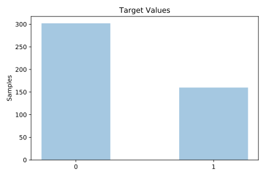
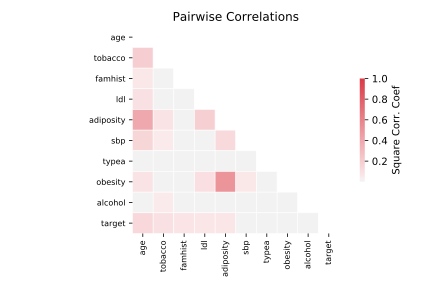

# saheart

[Metadata](metadata.yaml) | [Summary Statistics](summary_stats.csv)

## Summary

**task**: classification

**instances**: 462

**features**: 9

**number of classes**: 9

## Summary Plots

## Data Summary

|	variable	|	count	|	mean	|	std	|	min	|	25%	|	50%	|	75%	|	max|
| --- | --- | --- | --- | --- | --- | --- | --- | --- |
|	Sbp	|	462	|	138	|	20	|	101	|	124	|	134	|	148	|	218
|	Tobacco	|	462	|	3	|	4	|	0	|	0	|	2	|	5	|	31
|	Ldl	|	462	|	4	|	2	|	0	|	3	|	4	|	5	|	15
|	Adiposity	|	462	|	25	|	7	|	6	|	19	|	26	|	31	|	42
|	Famhist	|	462	|	0	|	0	|	0	|	0	|	0	|	1	|	1
|	Typea	|	462	|	53	|	9	|	13	|	47	|	53	|	60	|	78
|	Obesity	|	462	|	26	|	4	|	14	|	22	|	25	|	28	|	46
|	Alcohol	|	462	|	17	|	24	|	0	|	0	|	7	|	23	|	147
|	Age	|	462	|	42	|	14	|	15	|	31	|	45	|	55	|	64
|	target	|	462	|	0	|	0	|	0	|	0	|	0	|	1	|	1
