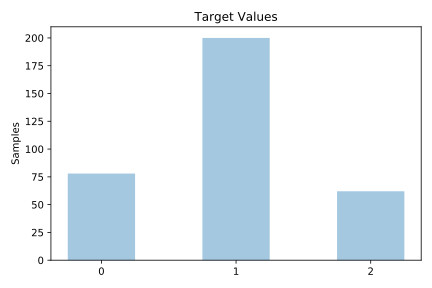
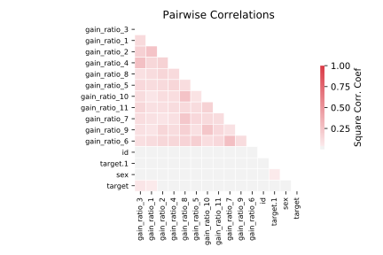

# schizo

[Metadata](metadata.yaml) | [Summary Statistics](summary_stats.csv)

## Summary

**task**: classification

**instances**: 340

**features**: 14

**number of classes**: 14

## Summary Plots

## Data Summary

|	variable	|	count	|	mean	|	std	|	min	|	25%	|	50%	|	75%	|	max|
| --- | --- | --- | --- | --- | --- | --- | --- | --- |
|	ID	|	340	|	134	|	89	|	7	|	59	|	130	|	233	|	276
|	target	|	340	|	0	|	0	|	0	|	1	|	1	|	1	|	2
|	gain_ratio_1	|	340	|	120	|	62	|	0	|	67	|	125	|	184	|	199
|	gain_ratio_2	|	340	|	117	|	60	|	0	|	67	|	121	|	180	|	193
|	gain_ratio_3	|	340	|	118	|	59	|	0	|	70	|	121	|	181	|	190
|	gain_ratio_4	|	340	|	123	|	64	|	0	|	71	|	126	|	189	|	202
|	gain_ratio_5	|	340	|	120	|	62	|	0	|	69	|	124	|	185	|	196
|	gain_ratio_6	|	340	|	121	|	62	|	0	|	70	|	128	|	189	|	194
|	gain_ratio_7	|	340	|	121	|	59	|	0	|	74	|	128	|	186	|	190
|	gain_ratio_8	|	340	|	118	|	60	|	0	|	67	|	127	|	184	|	187
|	gain_ratio_9	|	340	|	119	|	60	|	0	|	68	|	127	|	187	|	187
|	gain_ratio_10	|	340	|	126	|	62	|	0	|	73	|	135	|	195	|	195
|	gain_ratio_11	|	340	|	125	|	63	|	0	|	71	|	131	|	196	|	198
|	sex	|	340	|	0	|	0	|	0	|	0	|	1	|	1	|	1
|	target.1	|	340	|	0	|	0	|	0	|	0	|	0	|	1	|	1
