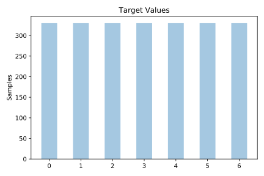
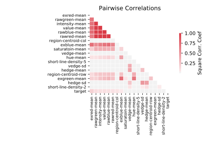

# segmentation

[Metadata](metadata.yaml) | [Summary Statistics](summary_stats.csv)

## Summary

**task**: classification

**instances**: 2310

**features**: 19

**number of classes**: 19

## Summary Plots

## Data Summary

|	variable	|	count	|	mean	|	std	|	min	|	25%	|	50%	|	75%	|	max|
| --- | --- | --- | --- | --- | --- | --- | --- | --- |
|	region-centroid-col	|	2310	|	124	|	72	|	1	|	62	|	121	|	189	|	254
|	region-centroid-row	|	2310	|	123	|	57	|	11	|	81	|	122	|	172	|	251
|	region-pixel-count	|	2310	|	9	|	0	|	9	|	9	|	9	|	9	|	9
|	short-line-density-5	|	2310	|	0	|	0	|	0	|	0	|	0	|	0	|	0
|	short-line-density-2	|	2310	|	0	|	0	|	0	|	0	|	0	|	0	|	0
|	vedge-mean	|	2310	|	1	|	2	|	0	|	0	|	1	|	2	|	29
|	vedge-sd	|	2310	|	5	|	44	|	0	|	0	|	0	|	1	|	991
|	hedge-mean	|	2310	|	2	|	3	|	0	|	0	|	1	|	2	|	44
|	hedge-sd	|	2310	|	8	|	58	|	0	|	0	|	0	|	2	|	1386
|	intensity-mean	|	2310	|	37	|	38	|	0	|	7	|	21	|	53	|	143
|	rawred-mean	|	2310	|	32	|	35	|	0	|	7	|	19	|	47	|	137
|	rawblue-mean	|	2310	|	44	|	43	|	0	|	9	|	27	|	64	|	150
|	rawgreen-mean	|	2310	|	34	|	36	|	0	|	6	|	20	|	46	|	142
|	exred-mean	|	2310	|	-12	|	11	|	-49	|	-18	|	-10	|	-4	|	9
|	exblue-mean	|	2310	|	21	|	19	|	-12	|	4	|	19	|	35	|	82
|	exgreen-mean	|	2310	|	-8	|	11	|	-33	|	-16	|	-10	|	-3	|	24
|	value-mean	|	2310	|	45	|	42	|	0	|	11	|	28	|	64	|	150
|	saturatoin-mean	|	2310	|	0	|	0	|	0	|	0	|	0	|	0	|	1
|	hue-mean	|	2310	|	-1	|	1	|	-3	|	-2	|	-2	|	-1	|	2
|	target	|	2310	|	3	|	2	|	0	|	1	|	3	|	5	|	6
