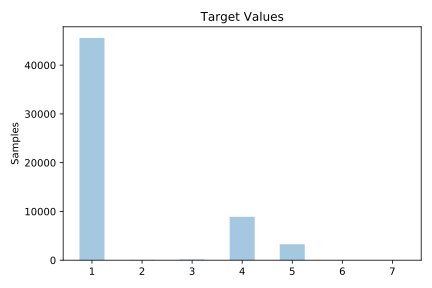
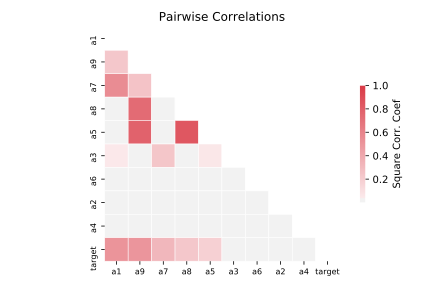

# shuttle

[Metadata](metadata.yaml) | [Summary Statistics](summary_stats.csv)

## Summary

**task**: classification

**instances**: 58000

**features**: 9

**number of classes**: 9

## Summary Plots

## Data Summary

|	variable	|	count	|	mean	|	std	|	min	|	25%	|	50%	|	75%	|	max|
| --- | --- | --- | --- | --- | --- | --- | --- | --- |
|	A1	|	58000	|	48	|	12	|	27	|	38	|	45	|	55	|	126
|	A2	|	58000	|	0	|	77	|	-4821	|	0	|	0	|	0	|	5075
|	A3	|	58000	|	85	|	8	|	21	|	79	|	83	|	89	|	149
|	A4	|	58000	|	0	|	36	|	-3939	|	0	|	0	|	0	|	3830
|	A5	|	58000	|	34	|	21	|	-188	|	26	|	42	|	46	|	436
|	A6	|	58000	|	1	|	217	|	-26739	|	-5	|	0	|	5	|	15164
|	A7	|	58000	|	37	|	13	|	-48	|	32	|	39	|	42	|	105
|	A8	|	58000	|	50	|	21	|	-353	|	37	|	44	|	60	|	270
|	A9	|	58000	|	13	|	25	|	-356	|	0	|	2	|	14	|	266
|	target	|	58000	|	1	|	1	|	1	|	1	|	1	|	1	|	7
