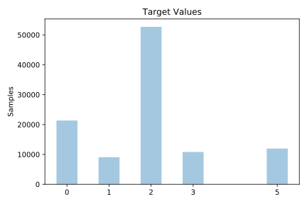
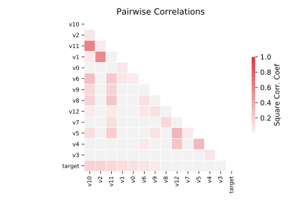

# sleep

[Metadata](metadata.yaml) | [Summary Statistics](summary_stats.csv)

## Summary

**task**: classification

**instances**: 105908

**features**: 13

**number of classes**: 13

## Summary Plots

## Data Summary

|	variable	|	count	|	mean	|	std	|	min	|	25%	|	50%	|	75%	|	max|
| --- | --- | --- | --- | --- | --- | --- | --- | --- |
|	V0	|	105908	|	0	|	1	|	0	|	0	|	0	|	0	|	10
|	V1	|	105908	|	4	|	2	|	0	|	2	|	4	|	6	|	10
|	V2	|	105908	|	4	|	3	|	0	|	2	|	4	|	7	|	10
|	V3	|	105908	|	1	|	3	|	0	|	0	|	0	|	2	|	10
|	V4	|	105908	|	6	|	1	|	0	|	5	|	7	|	8	|	10
|	V5	|	105908	|	1	|	2	|	0	|	0	|	1	|	3	|	10
|	V6	|	105908	|	6	|	2	|	0	|	5	|	6	|	8	|	10
|	V7	|	105908	|	5	|	1	|	0	|	5	|	6	|	6	|	10
|	V8	|	105908	|	2	|	1	|	0	|	1	|	2	|	4	|	10
|	V9	|	105908	|	5	|	1	|	0	|	4	|	5	|	6	|	10
|	V10	|	105908	|	4	|	3	|	0	|	2	|	5	|	7	|	10
|	V11	|	105908	|	5	|	2	|	0	|	4	|	6	|	8	|	10
|	V12	|	105908	|	4	|	1	|	0	|	3	|	4	|	5	|	10
|	target	|	105908	|	1	|	1	|	0	|	1	|	2	|	2	|	5
