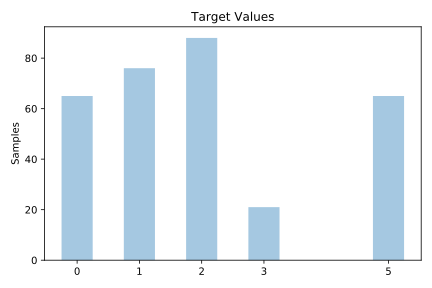
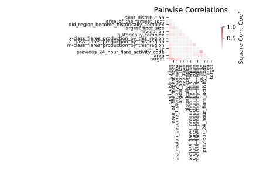

# solar_flare_1

[Metadata](metadata.yaml) | [Summary Statistics](summary_stats.csv)

## Summary

**task**: classification

**instances**: 315

**features**: 12

**number of classes**: 12

## Summary Plots

## Data Summary

|	variable	|	count	|	mean	|	std	|	min	|	25%	|	50%	|	75%	|	max|
| --- | --- | --- | --- | --- | --- | --- | --- | --- |
|	largest_spot_size	|	315	|	2	|	1	|	0	|	2	|	4	|	4	|	5
|	spot_distribution	|	315	|	1	|	0	|	0	|	1	|	2	|	2	|	3
|	Activity	|	315	|	1	|	0	|	1	|	1	|	1	|	1	|	2
|	Evolution	|	315	|	2	|	0	|	1	|	2	|	3	|	3	|	3
|	Previous_24_hour_flare_activity_code	|	315	|	1	|	0	|	1	|	1	|	1	|	1	|	3
|	Historically-complex	|	315	|	1	|	0	|	1	|	1	|	1	|	2	|	2
|	Did_region_become_historically_complex	|	315	|	1	|	0	|	1	|	2	|	2	|	2	|	2
|	Area	|	315	|	1	|	0	|	1	|	1	|	1	|	1	|	2
|	Area_of_the_largest_spot	|	315	|	1	|	0	|	1	|	1	|	2	|	2	|	2
|	C-class_flares_production_by_this_region	|	315	|	0	|	0	|	0	|	0	|	0	|	0	|	2
|	M-class_flares_production_by_this_region	|	315	|	0	|	0	|	0	|	0	|	0	|	0	|	4
|	X-class_flares_production_by_this_region	|	315	|	0	|	0	|	0	|	0	|	0	|	0	|	1
|	target	|	315	|	2	|	1	|	0	|	1	|	2	|	3	|	5
