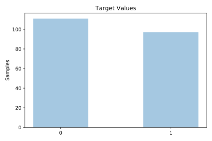
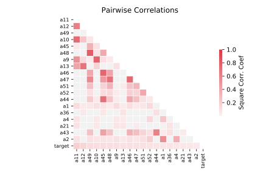

# sonar

[Metadata](metadata.yaml) | [Summary Statistics](summary_stats.csv)

## Summary

**task**: classification

**instances**: 208

**features**: 60

**number of classes**: 60

## Summary Plots

## Data Summary

|	variable	|	count	|	mean	|	std	|	min	|	25%	|	50%	|	75%	|	max|
| --- | --- | --- | --- | --- | --- | --- | --- | --- |
|	A1	|	208	|	0	|	0	|	0	|	0	|	0	|	0	|	0
|	A2	|	208	|	0	|	0	|	0	|	0	|	0	|	0	|	0
|	A3	|	208	|	0	|	0	|	0	|	0	|	0	|	0	|	0
|	A4	|	208	|	0	|	0	|	0	|	0	|	0	|	0	|	0
|	A5	|	208	|	0	|	0	|	0	|	0	|	0	|	0	|	0
|	A6	|	208	|	0	|	0	|	0	|	0	|	0	|	0	|	0
|	A7	|	208	|	0	|	0	|	0	|	0	|	0	|	0	|	0
|	A8	|	208	|	0	|	0	|	0	|	0	|	0	|	0	|	0
|	A9	|	208	|	0	|	0	|	0	|	0	|	0	|	0	|	0
|	A10	|	208	|	0	|	0	|	0	|	0	|	0	|	0	|	0
|	A11	|	208	|	0	|	0	|	0	|	0	|	0	|	0	|	0
|	A12	|	208	|	0	|	0	|	0	|	0	|	0	|	0	|	0
|	A13	|	208	|	0	|	0	|	0	|	0	|	0	|	0	|	0
|	A14	|	208	|	0	|	0	|	0	|	0	|	0	|	0	|	0
|	A15	|	208	|	0	|	0	|	0	|	0	|	0	|	0	|	1
|	A16	|	208	|	0	|	0	|	0	|	0	|	0	|	0	|	0
|	A17	|	208	|	0	|	0	|	0	|	0	|	0	|	0	|	1
|	A18	|	208	|	0	|	0	|	0	|	0	|	0	|	0	|	1
|	A19	|	208	|	0	|	0	|	0	|	0	|	0	|	0	|	1
|	A20	|	208	|	0	|	0	|	0	|	0	|	0	|	0	|	1
|	A21	|	208	|	0	|	0	|	0	|	0	|	0	|	0	|	1
|	A22	|	208	|	0	|	0	|	0	|	0	|	0	|	0	|	1
|	A23	|	208	|	0	|	0	|	0	|	0	|	0	|	0	|	1
|	A24	|	208	|	0	|	0	|	0	|	0	|	0	|	0	|	1
|	A25	|	208	|	0	|	0	|	0	|	0	|	0	|	0	|	1
|	A26	|	208	|	0	|	0	|	0	|	0	|	0	|	0	|	1
|	A27	|	208	|	0	|	0	|	0	|	0	|	0	|	0	|	1
|	A28	|	208	|	0	|	0	|	0	|	0	|	0	|	0	|	1
|	A29	|	208	|	0	|	0	|	0	|	0	|	0	|	0	|	1
|	A30	|	208	|	0	|	0	|	0	|	0	|	0	|	0	|	1
|	A31	|	208	|	0	|	0	|	0	|	0	|	0	|	0	|	0
|	A32	|	208	|	0	|	0	|	0	|	0	|	0	|	0	|	0
|	A33	|	208	|	0	|	0	|	0	|	0	|	0	|	0	|	1
|	A34	|	208	|	0	|	0	|	0	|	0	|	0	|	0	|	0
|	A35	|	208	|	0	|	0	|	0	|	0	|	0	|	0	|	1
|	A36	|	208	|	0	|	0	|	0	|	0	|	0	|	0	|	1
|	A37	|	208	|	0	|	0	|	0	|	0	|	0	|	0	|	0
|	A38	|	208	|	0	|	0	|	0	|	0	|	0	|	0	|	1
|	A39	|	208	|	0	|	0	|	0	|	0	|	0	|	0	|	0
|	A40	|	208	|	0	|	0	|	0	|	0	|	0	|	0	|	0
|	A41	|	208	|	0	|	0	|	0	|	0	|	0	|	0	|	0
|	A42	|	208	|	0	|	0	|	0	|	0	|	0	|	0	|	0
|	A43	|	208	|	0	|	0	|	0	|	0	|	0	|	0	|	0
|	A44	|	208	|	0	|	0	|	0	|	0	|	0	|	0	|	0
|	A45	|	208	|	0	|	0	|	0	|	0	|	0	|	0	|	0
|	A46	|	208	|	0	|	0	|	0	|	0	|	0	|	0	|	0
|	A47	|	208	|	0	|	0	|	0	|	0	|	0	|	0	|	0
|	A48	|	208	|	0	|	0	|	0	|	0	|	0	|	0	|	0
|	A49	|	208	|	0	|	0	|	0	|	0	|	0	|	0	|	0
|	A50	|	208	|	0	|	0	|	0	|	0	|	0	|	0	|	0
|	A51	|	208	|	0	|	0	|	0	|	0	|	0	|	0	|	0
|	A52	|	208	|	0	|	0	|	0	|	0	|	0	|	0	|	0
|	A53	|	208	|	0	|	0	|	0	|	0	|	0	|	0	|	0
|	A54	|	208	|	0	|	0	|	0	|	0	|	0	|	0	|	0
|	A55	|	208	|	0	|	0	|	0	|	0	|	0	|	0	|	0
|	A56	|	208	|	0	|	0	|	0	|	0	|	0	|	0	|	0
|	A57	|	208	|	0	|	0	|	0	|	0	|	0	|	0	|	0
|	A58	|	208	|	0	|	0	|	0	|	0	|	0	|	0	|	0
|	A59	|	208	|	0	|	0	|	0	|	0	|	0	|	0	|	0
|	A60	|	208	|	0	|	0	|	0	|	0	|	0	|	0	|	0
|	target	|	208	|	0	|	0	|	0	|	0	|	0	|	1	|	1
